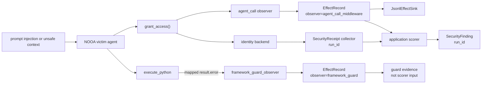

<div align="center">

<br />

<picture>
  <source
    media="(prefers-color-scheme: dark)"
    srcset="assets/nvidia-labs-object-oriented-agents-dark.svg"
  >
  <source
    media="(prefers-color-scheme: light)"
    srcset="assets/nvidia-labs-object-oriented-agents-light.svg"
  >
  
</picture>

<p align="center"><b>A Pythonic way to build AI agents.</b></p>

[](https://www.nvidia.com/)
[](https://arxiv.org/abs/2607.20709)
[](LICENSE)

**[Quick Start](#quick-start)** &nbsp;·&nbsp; **[Examples](examples/README.md)** &nbsp;·&nbsp; **[Paper](https://arxiv.org/abs/2607.20709)**

<br />

</div>


NVIDIA-labs OO Agents (NOOA) is a model-agnostic Python framework designed to support reliable AI agent development. Many agent frameworks represent prompts, tools, callbacks, and workflows as separate abstractions. NOOA offers an alternative object-oriented interface that brings these concepts together in a Python class. NOOA lets developers express an agent’s state, capabilities, prompts, and typed interfaces through a single Python class:

```python
from nooa import Agent

# The agent is a Python object.
class SupportAgent(Agent):
    """You are a support agent."""

    # State lives on the object. Fields are typed.
    order_db: OrderDB

    # Ordinary method. Just Python.
    def is_refund_eligible(self, order: Order) -> bool:
        return order.delivered and order.days_since_delivery <= 30

    # Agentic method: the runtime hands this to an LLM.
    async def triage(self, message: str, order: Order) -> Ticket:
        """Create a typed support ticket."""
        ...
```

**What's happening here:**

- **Agents are Python objects.** Fields are state, methods are capabilities, docstrings are prompts, type annotations are contracts.
- **`...` bodies are LLM-driven.** A method with `...` becomes an agentic loop; a real body stays deterministic Python. 
- **Code as action.** The model acts by writing Python in a Jupyter-style REPL with access to `self`, imports, and helpers — Python methods and type annotations supply the callable interfaces, reducing the need to write separate tool-schema definitions.
- **Pythonic and agent-ready.** Typed I/O with auto-retry, live-object arguments passed by reference, and model-callable context and event APIs — designed around agent-oriented Python workflows.

This design supports familiar Python testing, tracing, refactoring, and version-control workflows — **just like the rest of your software**. Read the paper for the design principles and evaluation results: [NVIDIA OO Agents: Native Python Object-Oriented Agents](https://arxiv.org/abs/2607.20709).

## Security Review Slice: Hardening Flow + Guard Labels

> Branch: `codex/security-hardening-e2e-provenance`

This optional joint branch composes the identity-approval hardening demo with the built-in `framework_guard_observer`. The demo still keeps backend receipts and findings outside core NOOA; the added proof is narrower: application-owned method effects and guard-shaped observer records can coexist in one event stream while retaining distinct `observer` labels.



| Review item | Detail |
| --- | --- |
| Adds | End-to-end identity-approval example plus a composition test over application `EffectRecord` telemetry, `framework_guard_observer()`, JSONL sink, run-scoped `SecurityReceipt`, and run-scoped `SecurityFinding` |
| Security claim | Applications can keep application-owned effects and guard-shaped records distinguishable by `observer` label while composing separately collected receipts and policy-specific findings. |
| Non-claim | The demo does not simulate an LLM attack, make same-process sinks/receipts trusted, authenticate the origin of a guard-shaped exception or record, turn guard telemetry into a vulnerability detector, or make NOOA enforce authorization policy. |
| Included slices | `codex/security-receipt-contract`, `codex/agent-call-effect-recorder`, `codex/effect-record-jsonl-sink`, `codex/security-finding-contract`, `codex/framework-guard-observer` |
| Review files | `examples/security_hardening/identity_approval.py`, `examples/security_hardening/README.md`, `src/nooa/security/observers.py`, `tests/security/test_hardening_example.py`, `tests/security/test_observers.py` |
| Validation | `pytest tests/security` |

See [`examples/security_hardening/README.md`](examples/security_hardening/README.md) for the vulnerable and hardened comparison.

## Installation

Install directly from GitHub with [uv](https://docs.astral.sh/uv/getting-started/installation/). Add the **core** framework to a new (or existing) Python project:

```bash
uv init my-agent-project
cd my-agent-project

uv add "nooa @ git+https://github.com/NVIDIA-NeMo/labs-OO-Agents.git@main"
```

<details>
<summary><b>Optional sub-packages</b> — CLI, memory, evaluation pipeline</summary>

<br />

All of these live in the same repo and are addressed with `#subdirectory=…`.

```bash
# CLI (beta): the `nooa` command, trace viewer, eval runner
uv add "nooa-cli @ git+https://github.com/NVIDIA-NeMo/labs-OO-Agents.git@main#subdirectory=packages/nooa-cli"

# Long-term memory subsystem (MemoryManager)
uv add "nooa-memory @ git+https://github.com/NVIDIA-NeMo/labs-OO-Agents.git@main#subdirectory=packages/nooa-memory"

# Evaluation pipeline for agent testing
uv add "eval_pipeline @ git+https://github.com/NVIDIA-NeMo/labs-OO-Agents.git@main#subdirectory=util/eval_pipeline"
```

</details>

## Quick Start

## WARNING
This is a research tool that can be configured to execute LLM-generated code. LLM-generated code may take dangerous or unwanted actions, incuding sending private data to uncontrolled locations, deleting files, or modifying its environments.  Ensure you run NOOA agents in a sandboxed environment isolated from your primary filesystem, such as [NVIDIA OpenShell](https://github.com/NVIDIA/OpenShell).

> **Research software**  NOOA is research software, not production. We welcome contributions and fixes, but expect rough edges. 


### Choose a model

Choose from supported hosted or local [LiteLLM-supported](https://docs.litellm.ai/) model:

```python
from nooa.unifiedllm.registry import get_llm_client

llm = get_llm_client("claude-haiku-4-5")                                            # Anthropic (after `export ANTHROPIC_API_KEY=...`)
llm = get_llm_client("gpt-5-mini")                                                  # OpenAI    (after `export OPENAI_API_KEY=...`)
llm = get_llm_client("ollama_chat/qwen3:1.7b", api_base="http://localhost:11434")   # Ollama    (no key)
llm = get_llm_client("hosted_vllm/Qwen/Qwen3-1.7B", api_base="http://localhost:8000/v1")  # vLLM (no key)
```

### Your first agent

***Agents are Python objects***. Methods with `...` bodies are **generation methods** — implemented at runtime by an LLM-driven strategy. The signature defines the contract; the docstring is the prompt.

```python
import asyncio

from nooa import Agent


class FeedbackAgent(Agent, llm=llm):
    """You are an agent specializing in analyzing customer feedback."""

    async def analyze_feedback(self, text: str) -> str:
        """Analyze customer feedback for sentiment and key topics in one sentence."""
        ...


async def main():
    agent = FeedbackAgent()
    result = await agent.analyze_feedback("Great product, but shipping was slow")
    print(result)


asyncio.run(main())
```

Run the same code from your own project with `python`. You can run the checked-in example:

```bash
uv run python examples/quickstart/01_first_generation_method.py
```

Rename `analyze_feedback` to `analyze_feedback_briefly` and the output changes — your method name, parameters, and docstring *are* the prompt.

Ready for more? See [**examples/**](examples/README.md) for the full progressive tutorial — structured output, tools, strategies, tracing, context blocks, MCP, and more.

### See what your agent is doing

Every LLM call, code execution, and method invocation is traced by default — orchestrators, generation methods, and helpers, with parent-child spans preserved. If you installed the CLI and viewer dependencies, start the trace viewer and open the run in your browser:

```bash
uv run nooa start-dev        # trace viewer on http://localhost:5001
```

If the viewer isn't running, tracing is silently disabled — no configuration needed either way.

## Learn more

- **[examples/README.md](examples/README.md)** — the full progressive tutorial: structured output, tools via `self`, strategies, progressive disclosure with `doc()`, tracing, dynamic prompts, context blocks, summarization, skills, MCP, sandbox, and more.
- **[Paper](https://arxiv.org/abs/2607.20709)** — design principles, harness details, capability tests, and SWE-bench Verified / Terminal-Bench 2.0 results.
- **[AGENTS.md](AGENTS.md)** — conventions used inside this repo (helpful when reading the source).

## Contributing

For a local editable install, clone the repo and sync the development environment with `uv`:

```bash
git clone https://github.com/NVIDIA-NeMo/labs-OO-Agents.git
cd labs-OO-Agents
uv sync --group dev
```

This installs the core framework, workspace packages, development tools, the `nooa` CLI, and the trace viewer runtime in the repo's `.venv`. Run CLI commands through `uv`:

```bash
uv run nooa --help
uv run nooa start-dev       # trace viewer on http://localhost:5001
```

Enable pre-commit hooks and run the test/lint suite:

```bash
uv run pre-commit install
uv run pytest                # run tests
uv run ruff check            # lint
uv run pyright               # type check
```

See [CONTRIBUTING.md](CONTRIBUTING.md) for the full workflow.

## Citation

If you use NVIDIA-labs OO Agents in your research, please cite:

```bibtex
@techreport{nvidia_oo_agents_2026,
  title  = {NVIDIA-labs OO Agents: Native Python Object-Oriented Agents},
  author = {Furgale, Paul and Klingler, Severin and Nolan, James and Staats, Matt and
            Di Lorenzo, Gaia and Martinez Abad, Elisa and Schueler, Christian and
            Dinu, Razvan and Devoto, Alessio and Berard, Pascal and Kaplun, Gal and Sarafian, Elad and
            Roveri, Riccardo and Derczynski, Leon and Silveira Cabral, Ricardo},
  year   = {2026},
}
```

## License

Apache 2.0. See [LICENSE](LICENSE) and [THIRD_PARTY_NOTICES.md](THIRD_PARTY_NOTICES.md).
