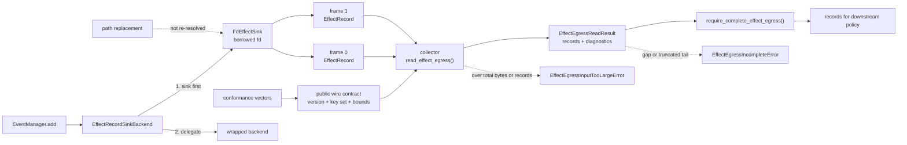

<div align="center">

<br />

<picture>
  <source
    media="(prefers-color-scheme: dark)"
    srcset="assets/nvidia-labs-object-oriented-agents-dark.svg"
  >
  <source
    media="(prefers-color-scheme: light)"
    srcset="assets/nvidia-labs-object-oriented-agents-light.svg"
  >
  
</picture>

<p align="center"><b>A Pythonic way to build AI agents.</b></p>

[](https://www.nvidia.com/)
[](https://arxiv.org/abs/2607.20709)
[](LICENSE)

**[Quick Start](#quick-start)** &nbsp;·&nbsp; **[Examples](examples/README.md)** &nbsp;·&nbsp; **[Paper](https://arxiv.org/abs/2607.20709)**

<br />

</div>


NVIDIA-labs OO Agents (NOOA) is a model-agnostic Python framework designed to support reliable AI agent development. Many agent frameworks represent prompts, tools, callbacks, and workflows as separate abstractions. NOOA offers an alternative object-oriented interface that brings these concepts together in a Python class. NOOA lets developers express an agent’s state, capabilities, prompts, and typed interfaces through a single Python class:

```python
from nooa import Agent

# The agent is a Python object.
class SupportAgent(Agent):
    """You are a support agent."""

    # State lives on the object. Fields are typed.
    order_db: OrderDB

    # Ordinary method. Just Python.
    def is_refund_eligible(self, order: Order) -> bool:
        return order.delivered and order.days_since_delivery <= 30

    # Agentic method: the runtime hands this to an LLM.
    async def triage(self, message: str, order: Order) -> Ticket:
        """Create a typed support ticket."""
        ...
```

**What's happening here:**

- **Agents are Python objects.** Fields are state, methods are capabilities, docstrings are prompts, type annotations are contracts.
- **`...` bodies are LLM-driven.** A method with `...` becomes an agentic loop; a real body stays deterministic Python. 
- **Code as action.** The model acts by writing Python in a Jupyter-style REPL with access to `self`, imports, and helpers — Python methods and type annotations supply the callable interfaces, reducing the need to write separate tool-schema definitions.
- **Pythonic and agent-ready.** Typed I/O with auto-retry, live-object arguments passed by reference, and model-callable context and event APIs — designed around agent-oriented Python workflows.

This design supports familiar Python testing, tracing, refactoring, and version-control workflows — **just like the rest of your software**. Read the paper for the design principles and evaluation results: [NVIDIA OO Agents: Native Python Object-Oriented Agents](https://arxiv.org/abs/2607.20709).

## Security Review Slice: Effect Egress Input Budget

> Branch: `codex/security-effect-egress-input-budget`

This branch builds on `codex/security-effect-egress-completeness-gate` and closes the remaining unbounded-input gap in the collector reader. `read_effect_egress()` still keeps the V1 wire envelope unchanged, but it now accepts explicit `max_total_bytes` and `max_records` budgets, defaults them to `256 MiB` and `1,048,576`, and raises `EffectEgressInputTooLargeError` when either collector-wide budget is exhausted. This keeps an attacker-controlled descriptor stream from growing parsed collector state without bound while preserving the existing distinction between invalid bytes (`ValueError` subclasses) and parsed-but-incomplete transport (`EffectEgressIncompleteError`). The new budgets are DoS backstops, not detector thresholds or authorization policy.



| Review item | Detail |
| --- | --- |
| Adds | Public `EffectEgressInputTooLargeError`, `DEFAULT_EFFECT_EGRESS_MAX_TOTAL_BYTES`, and `DEFAULT_EFFECT_EGRESS_MAX_RECORDS` on top of the V1 `FdEffectSink`, completeness gate, public wire constants, conformance vectors, and exact V1 record-shape checks |
| Security claim | A downstream collector can bound both total consumed egress bytes and retained complete records while keeping over-budget input distinct from parsed short or gapped transport. |
| Non-claim | These limits are local collector resource backstops. A clean result, including an empty stream, does not authenticate records, prove an effect happened, prove omitted effects did not happen, distinguish a malicious clean stop from a valid one, provide detector authority or severity semantics, enforce authorization, or prevent an effect. A descriptor can still be forged, closed, sought, truncated, or reordered by code that can access it. Publishing the V1 wire grammar or the conformance-v3 metadata does not promise future-version stability. |
| Shared base | `codex/security-effect-egress-completeness-gate`; this is a narrow collector-safety follow-up rather than an end-to-end merge. |
| Review files | `src/nooa/security/egress.py`, `src/nooa/security/__init__.py`, `tests/security/test_egress.py`, `tests/security/fixtures/effect_egress_conformance_v3.json`, `README.md` |
| Validation | `pytest tests/security/test_egress.py tests/security/test_sinks.py` |

## Effect Egress V1 Wire Contract

An independent collector may rely on these public exports:

| Export | Value |
| --- | --- |
| `EFFECT_EGRESS_SCHEMA_VERSION` | `"nooa-effect-egress-v1"` |
| `EFFECT_EGRESS_SCHEMA_VERSION_PATTERN` | `nooa-effect-egress-v[1-9][0-9]*` |
| `EFFECT_EGRESS_SCHEMA_VERSION_PATTERN_MATCH_MODE` | `"full"` |
| `EFFECT_EGRESS_FRAME_KEYS` | `{"schema_version", "sequence", "record"}` |
| `EFFECT_EGRESS_RECORD_EVENT_TYPE` | `"EffectRecord"` |
| `EFFECT_EGRESS_RECORD_KEYS` | `{"event_type", "id", "metadata", "status", "tag", "timestamp", "effect_type", "target", "decision", "observer", "generation_id", "tool_call_id", "attributes"}` |
| `EffectEgressCompletenessSignal` | `Literal["first_sequence_error", "truncated"]` |
| `EFFECT_EGRESS_COMPLETENESS_SIGNALS` | `("first_sequence_error", "truncated")` |
| `MAX_EFFECT_EGRESS_JSON_INTEGER` | `9007199254740991` |
| `MAX_EFFECT_EGRESS_SEQUENCE` | `9007199254740991` |
| `DEFAULT_EFFECT_EGRESS_MAX_FRAME_BYTES` | `1048576` |
| `DEFAULT_EFFECT_EGRESS_MAX_TOTAL_BYTES` | `268435456` |
| `DEFAULT_EFFECT_EGRESS_MAX_RECORDS` | `1048576` |

A collector that wants a fail-closed handoff can pass the
`EffectEgressReadResult` from `read_effect_egress()` to
`require_complete_effect_egress()`. The helper returns that result's exact
`records` tuple when `first_sequence_error is None` and `truncated is False`.
Otherwise it raises `EffectEgressIncompleteError`, whose `reasons`,
`first_sequence_error`, and `truncated` fields preserve the reader-visible
degradation without inventing a detector verdict.

The conformance fixture's own `schema_version` is
`"nooa-effect-egress-conformance-v3"` because it now publishes the collector
budget defaults and their refusal vectors. Its `wire_schema_version` remains
`"nooa-effect-egress-v1"`; the wire envelope itself is unchanged.

The V1 transport is LF-delimited UTF-8 JSON. Each complete frame ends in one LF
byte, has no BOM or leading/trailing whitespace outside the JSON object, and
contains exactly the three keys above. CRLF termination is invalid; internal
JSON whitespace is allowed. Duplicate object keys, non-standard numeric
constants such as `NaN` or `Infinity`, integer literals outside
`-MAX_EFFECT_EGRESS_JSON_INTEGER..MAX_EFFECT_EGRESS_JSON_INTEGER`, numeric
literals that overflow to a non-finite value, and lone-surrogate string escapes
are invalid.

```json
{"schema_version":"nooa-effect-egress-v1","sequence":0,"record":{"event_type":"EffectRecord","id":"00000000-0000-0000-0000-000000000001","metadata":{},"status":"active","tag":null,"timestamp":"2026-07-27T00:00:00","effect_type":"fs.write","target":"/tmp/a","decision":"observed","observer":"","generation_id":"","tool_call_id":"","attributes":{}}}
```

The contract is intentionally narrow:

- `schema_version` must equal `EFFECT_EGRESS_SCHEMA_VERSION`; a future token whose entire value matches `EFFECT_EGRESS_SCHEMA_VERSION_PATTERN` under `EFFECT_EGRESS_SCHEMA_VERSION_PATTERN_MATCH_MODE == "full"` raises `UnsupportedEffectEgressVersionError`. Use a whole-string API such as Python `re.fullmatch()` or its equivalent; do not emulate it with prefix/substring matching or `^...$`, which can treat a trailing newline specially. The pattern accepts `v1`, `v2`, and `v10`, but not `v0`, `v01`, case variants, or tokens with trailing whitespace or newline.
- Every integer in the V1 JSON payload must stay within `-MAX_EFFECT_EGRESS_JSON_INTEGER..MAX_EFFECT_EGRESS_JSON_INTEGER`, which keeps values exact in JSON implementations that use IEEE-754 numbers.
- `sequence` is a strict integer in the inclusive range `0..MAX_EFFECT_EGRESS_SEQUENCE`, where `MAX_EFFECT_EGRESS_SEQUENCE == MAX_EFFECT_EGRESS_JSON_INTEGER`. The collector records the first `(expected, observed)` discontinuity but still returns the complete frames it could parse.
- `record` must contain exactly `EFFECT_EGRESS_RECORD_KEYS`, carry `event_type == EFFECT_EGRESS_RECORD_EVENT_TYPE`, and validate as an `EffectRecord`. V1 treats the full writer-emitted `EffectRecord` payload shape as part of this compatibility contract; omitted defaulted fields such as `id` or `timestamp` are invalid rather than minted at read time. Changing accepted record fields requires a V2 envelope or an explicitly versioned record payload.
- `FdEffectSink` rejects `EffectRecord` instances whose serialized payload would add V1-incompatible fields, change the V1 event type, contain V1-invalid scalar values such as out-of-range integers, non-finite floats, or lone surrogates, or require cyclic or non-JSON-native `metadata` values to be rewritten during envelope serialization. `JsonlEffectSink` is a separate raw-record sink and should not be treated as a V1 envelope compatibility oracle.
- `read_effect_egress()` starts sequence validation at `0`, so attaching to a stream after its first frame intentionally reports an initial discontinuity and `require_complete_effect_egress()` refuses that parsed result by design.
- A trailing unterminated line is reported as `truncated=True` and is not parsed as a record.
- `require_complete_effect_egress()` is a convenience gate over those two reader diagnostics only. A clean result, including an empty stream, is not proof that no effect was omitted or that the records are authentic.
- `read_effect_egress()` accepts positive `max_total_bytes` and `max_records` budgets in addition to `max_frame_bytes`. The total-byte budget covers payload bytes admitted to parsing, including complete frames and a trailing unterminated line; the reader may use one bounded lookahead byte to distinguish exact EOF from overflow. The record budget counts only complete parsed records. Exceeding either budget raises `EffectEgressInputTooLargeError` and is not downgraded to truncation.
- A newline-terminated malformed frame raises a generic `ValueError`. Callers that distinguish outcomes must catch `UnsupportedEffectEgressVersionError`, `EffectEgressFrameTooLargeError`, and `EffectEgressInputTooLargeError` before a generic `ValueError` handler because all three distinguished errors subclass `ValueError`; `EffectEgressIncompleteError` is a `RuntimeError`, so `require_complete_effect_egress(read_effect_egress(fh))` keeps invalid bytes distinct from a parsed short or gapped stream.
- A line larger than the configured frame maximum, counting the terminating LF byte for complete frames, raises `EffectEgressFrameTooLargeError` when the reader reaches that frame bound before the total-byte budget; it is not downgraded to truncation.

The checked-in `tests/security/fixtures/effect_egress_conformance_v3.json`
vectors cover empty input, compact and internally-spaced valid frames,
well-formed multi-frame input, forward, duplicate, and backward sequence
discontinuities, first-error-wins behavior after a later backward step, exact
and one-over sequence bounds, exact and one-over record integer bounds, a
trailing partial frame, exact-max and over-bound complete and unterminated
lines, exact and one-over collector total-byte and complete-record budgets,
future-version classification including malformed near misses such as a
trailing newline escape, strict
LF framing without BOM or outer whitespace, blank and malformed frames
including a second-line failure, negative sequence rejection, each missing
required key, a missing defaulted record key, unexpected envelope and record
keys including wrong or empty record event types, duplicate object keys,
non-standard numeric constants, out-of-range integer literals, numeric
overflow literals, lone-surrogate escapes, and one invalid UTF-8 line encoded
as `payload_base64`.
They are V1 reader compatibility fixtures for independent collectors, not
evidence-authenticity fixtures.

## Installation

Install directly from GitHub with [uv](https://docs.astral.sh/uv/getting-started/installation/). Add the **core** framework to a new (or existing) Python project:

```bash
uv init my-agent-project
cd my-agent-project

uv add "nooa @ git+https://github.com/NVIDIA-NeMo/labs-OO-Agents.git@main"
```

<details>
<summary><b>Optional sub-packages</b> — CLI, memory, evaluation pipeline</summary>

<br />

All of these live in the same repo and are addressed with `#subdirectory=…`.

```bash
# CLI (beta): the `nooa` command, trace viewer, eval runner
uv add "nooa-cli @ git+https://github.com/NVIDIA-NeMo/labs-OO-Agents.git@main#subdirectory=packages/nooa-cli"

# Long-term memory subsystem (MemoryManager)
uv add "nooa-memory @ git+https://github.com/NVIDIA-NeMo/labs-OO-Agents.git@main#subdirectory=packages/nooa-memory"

# Evaluation pipeline for agent testing
uv add "eval_pipeline @ git+https://github.com/NVIDIA-NeMo/labs-OO-Agents.git@main#subdirectory=util/eval_pipeline"
```

</details>

## Quick Start

## WARNING
This is a research tool that can be configured to execute LLM-generated code. LLM-generated code may take dangerous or unwanted actions, incuding sending private data to uncontrolled locations, deleting files, or modifying its environments.  Ensure you run NOOA agents in a sandboxed environment isolated from your primary filesystem, such as [NVIDIA OpenShell](https://github.com/NVIDIA/OpenShell).

> **Research software**  NOOA is research software, not production. We welcome contributions and fixes, but expect rough edges. 


### Choose a model

Choose from supported hosted or local [LiteLLM-supported](https://docs.litellm.ai/) model:

```python
from nooa.unifiedllm.registry import get_llm_client

llm = get_llm_client("claude-haiku-4-5")                                            # Anthropic (after `export ANTHROPIC_API_KEY=...`)
llm = get_llm_client("gpt-5-mini")                                                  # OpenAI    (after `export OPENAI_API_KEY=...`)
llm = get_llm_client("ollama_chat/qwen3:1.7b", api_base="http://localhost:11434")   # Ollama    (no key)
llm = get_llm_client("hosted_vllm/Qwen/Qwen3-1.7B", api_base="http://localhost:8000/v1")  # vLLM (no key)
```

### Your first agent

***Agents are Python objects***. Methods with `...` bodies are **generation methods** — implemented at runtime by an LLM-driven strategy. The signature defines the contract; the docstring is the prompt.

```python
import asyncio

from nooa import Agent


class FeedbackAgent(Agent, llm=llm):
    """You are an agent specializing in analyzing customer feedback."""

    async def analyze_feedback(self, text: str) -> str:
        """Analyze customer feedback for sentiment and key topics in one sentence."""
        ...


async def main():
    agent = FeedbackAgent()
    result = await agent.analyze_feedback("Great product, but shipping was slow")
    print(result)


asyncio.run(main())
```

Run the same code from your own project with `python`. You can run the checked-in example:

```bash
uv run python examples/quickstart/01_first_generation_method.py
```

Rename `analyze_feedback` to `analyze_feedback_briefly` and the output changes — your method name, parameters, and docstring *are* the prompt.

Ready for more? See [**examples/**](examples/README.md) for the full progressive tutorial — structured output, tools, strategies, tracing, context blocks, MCP, and more.

### See what your agent is doing

Every LLM call, code execution, and method invocation is traced by default — orchestrators, generation methods, and helpers, with parent-child spans preserved. If you installed the CLI and viewer dependencies, start the trace viewer and open the run in your browser:

```bash
uv run nooa start-dev        # trace viewer on http://localhost:5001
```

If the viewer isn't running, tracing is silently disabled — no configuration needed either way.

## Learn more

- **[examples/README.md](examples/README.md)** — the full progressive tutorial: structured output, tools via `self`, strategies, progressive disclosure with `doc()`, tracing, dynamic prompts, context blocks, summarization, skills, MCP, sandbox, and more.
- **[Paper](https://arxiv.org/abs/2607.20709)** — design principles, harness details, capability tests, and SWE-bench Verified / Terminal-Bench 2.0 results.
- **[AGENTS.md](AGENTS.md)** — conventions used inside this repo (helpful when reading the source).

## Contributing

For a local editable install, clone the repo and sync the development environment with `uv`:

```bash
git clone https://github.com/NVIDIA-NeMo/labs-OO-Agents.git
cd labs-OO-Agents
uv sync --group dev
```

This installs the core framework, workspace packages, development tools, the `nooa` CLI, and the trace viewer runtime in the repo's `.venv`. Run CLI commands through `uv`:

```bash
uv run nooa --help
uv run nooa start-dev       # trace viewer on http://localhost:5001
```

Enable pre-commit hooks and run the test/lint suite:

```bash
uv run pre-commit install
uv run pytest                # run tests
uv run ruff check            # lint
uv run pyright               # type check
```

See [CONTRIBUTING.md](CONTRIBUTING.md) for the full workflow.

## Citation

If you use NVIDIA-labs OO Agents in your research, please cite:

```bibtex
@techreport{nvidia_oo_agents_2026,
  title  = {NVIDIA-labs OO Agents: Native Python Object-Oriented Agents},
  author = {Furgale, Paul and Klingler, Severin and Nolan, James and Staats, Matt and
            Di Lorenzo, Gaia and Martinez Abad, Elisa and Schueler, Christian and
            Dinu, Razvan and Devoto, Alessio and Berard, Pascal and Kaplun, Gal and Sarafian, Elad and
            Roveri, Riccardo and Derczynski, Leon and Silveira Cabral, Ricardo},
  year   = {2026},
}
```

## License

Apache 2.0. See [LICENSE](LICENSE) and [THIRD_PARTY_NOTICES.md](THIRD_PARTY_NOTICES.md).
