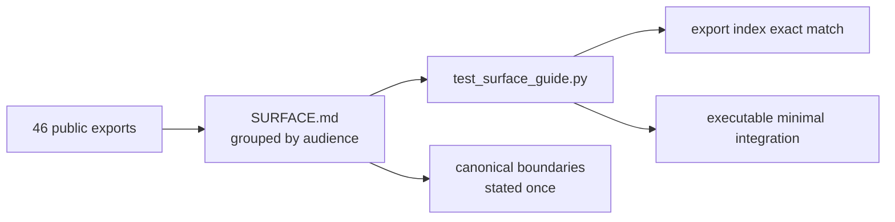
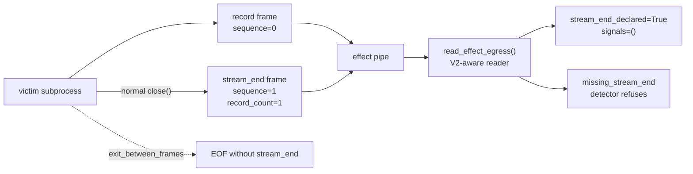
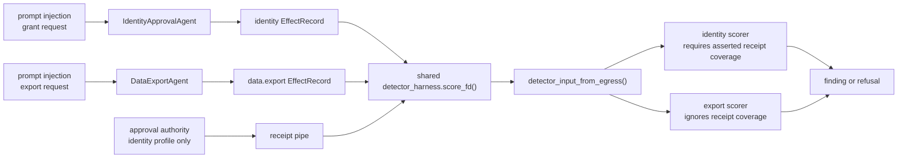
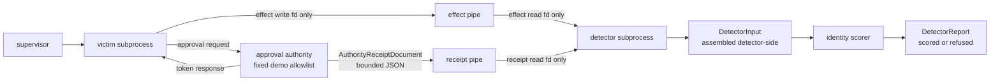
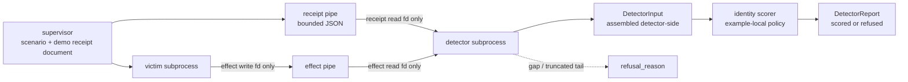
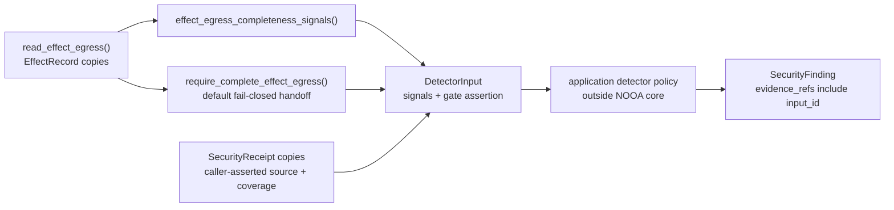
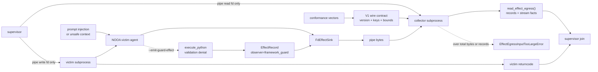

<div align="center">

<br />

<picture>
  <source
    media="(prefers-color-scheme: dark)"
    srcset="assets/nvidia-labs-object-oriented-agents-dark.svg"
  >
  <source
    media="(prefers-color-scheme: light)"
    srcset="assets/nvidia-labs-object-oriented-agents-light.svg"
  >
  
</picture>

<p align="center"><b>A Pythonic way to build AI agents.</b></p>

[](https://www.nvidia.com/)
[](https://arxiv.org/abs/2607.20709)
[](LICENSE)

**[Quick Start](#quick-start)** &nbsp;·&nbsp; **[Examples](examples/README.md)** &nbsp;·&nbsp; **[Paper](https://arxiv.org/abs/2607.20709)**

<br />

</div>


NVIDIA-labs OO Agents (NOOA) is a model-agnostic Python framework designed to support reliable AI agent development. Many agent frameworks represent prompts, tools, callbacks, and workflows as separate abstractions. NOOA offers an alternative object-oriented interface that brings these concepts together in a Python class. NOOA lets developers express an agent’s state, capabilities, prompts, and typed interfaces through a single Python class:

```python
from nooa import Agent

# The agent is a Python object.
class SupportAgent(Agent):
    """You are a support agent."""

    # State lives on the object. Fields are typed.
    order_db: OrderDB

    # Ordinary method. Just Python.
    def is_refund_eligible(self, order: Order) -> bool:
        return order.delivered and order.days_since_delivery <= 30

    # Agentic method: the runtime hands this to an LLM.
    async def triage(self, message: str, order: Order) -> Ticket:
        """Create a typed support ticket."""
        ...
```

**What's happening here:**

- **Agents are Python objects.** Fields are state, methods are capabilities, docstrings are prompts, type annotations are contracts.
- **`...` bodies are LLM-driven.** A method with `...` becomes an agentic loop; a real body stays deterministic Python. 
- **Code as action.** The model acts by writing Python in a Jupyter-style REPL with access to `self`, imports, and helpers — Python methods and type annotations supply the callable interfaces, reducing the need to write separate tool-schema definitions.
- **Pythonic and agent-ready.** Typed I/O with auto-retry, live-object arguments passed by reference, and model-callable context and event APIs — designed around agent-oriented Python workflows.

This design supports familiar Python testing, tracing, refactoring, and version-control workflows — **just like the rest of your software**. Read the paper for the design principles and evaluation results: [NVIDIA OO Agents: Native Python Object-Oriented Agents](https://arxiv.org/abs/2607.20709).

## Security Review Follow-On: Checked Security Surface Guide

> Branch: `codex/security-surface-guide`

This slice adds no new runtime behavior. It consolidates the current `nooa.security` surface into one checked guide beside the hardening examples, so a maintainer can review the composed API without reconstructing ten chronological branch deltas. A new test keeps the guide's export index aligned with `nooa.security.__all__` and executes the documented minimal V2 sink-to-detector path.



| Review item | Detail |
| --- | --- |
| Adds | `examples/security_hardening/SURFACE.md`, a grouped export index, one runnable minimal integration, consolidated trust-boundary statements, and `tests/security/test_surface_guide.py` |
| Security claim | The documented surface is checked against the actual public export list, and the documented minimal sink-to-`DetectorInput` path is executable against the current API. |
| Non-claim | Documentation is not a security control, an API stability guarantee, or a hardened deployment recipe. Grouping exports by audience is editorial and does not restrict access, authenticate evidence, or add enforcement. |
| Base slice | `codex/security-effect-egress-stream-end-v2` |
| Review files | `examples/security_hardening/SURFACE.md`, `examples/security_hardening/README.md`, `examples/README.md`, `tests/security/test_surface_guide.py`, `README.md` |
| Validation | `pytest tests/security/test_surface_guide.py`; `git diff --quiet 805b8e6 -- src/nooa`; `pytest` |

Read the consolidated guide at [`examples/security_hardening/SURFACE.md`](examples/security_hardening/SURFACE.md).

## Security Review Follow-On: V2 Effect Egress Stream End

> Branch: `codex/security-effect-egress-stream-end-v2`

This slice adds an opt-in `nooa-effect-egress-v2` envelope beside the existing V1 default. A V2 `FdEffectSink.close()` writes one explicit stream-end frame with the next sequence number and a writer-declared record count; `read_effect_egress()` preserves that fact as `stream_end_declared` and `declared_record_count`. The subprocess examples opt into V2 so a victim that exits between complete frames is no longer reported like an orderly writer close.



| Scenario | Received records | Stream end | Completeness signals | Detector result |
| --- | --- | --- | --- | --- |
| Normal V2 victim run | 1 | Declared | `()` | Scoreable |
| `--victim-fault partial_tail_crash` | 1 | Missing | `("truncated", "missing_stream_end")` | Refused |
| `--victim-fault exit_between_frames` | 1 | Missing | `("missing_stream_end",)` | Refused |
| Legacy V1 stream | Any | Not applicable | Existing V1 signals only | Backward compatible |

| Review item | Detail |
| --- | --- |
| Adds | Public V2 schema constants, one writer-declared stream-end frame, version-aware read results, `missing_stream_end` and `record_count_mismatch` diagnostics, V2 conformance vectors, and V2 opt-in for the collector/detector examples |
| Security claim | A collector that explicitly expects V2 can distinguish orderly writer-declared completion from EOF between complete frames, and can refuse a record-count mismatch without breaking V1 readers or V1 default writers. |
| Non-claim | A valid-looking stream-end frame is not authentication, attestation, or proof that every effect was emitted. A compromised writer can still forge records, forge a terminator, omit effects before closing, or share the same-user same-host process boundary. |
| Base slice | `codex/security-second-victim-detector-generality` |
| Review files | `src/nooa/security/egress.py`, `src/nooa/security/__init__.py`, `tests/security/test_egress.py`, `tests/security/fixtures/effect_egress_stream_end_conformance_v1.json`, `examples/security_hardening/effect_collector.py`, `examples/security_hardening/detector_harness.py`, `examples/security_hardening/README.md`, `examples/README.md`, `tests/security/test_effect_collector.py`, `tests/security/test_detector_harness.py`, `tests/security/test_data_export_example.py` |
| Validation | `pytest tests/security`; `pytest` |

Run the V2 subprocess paths:

```bash
uv run python -m examples.security_hardening.effect_collector demo --victim-fault exit_between_frames
uv run python -m examples.security_hardening.detector_harness demo --scenario vulnerable_attack --victim-fault exit_between_frames
uv run python -m examples.security_hardening.detector_harness demo --scenario export_vulnerable_attack --victim-fault exit_between_frames
```

See [`examples/security_hardening/README.md`](examples/security_hardening/README.md) for the V2 framing diagram, exact refusal behavior, and trust-boundary limits.

## Security Review Follow-On: Second Victim Detector Generality

> Branch: `codex/security-second-victim-detector-generality`

This slice adds a second example victim without changing `src/nooa/**`: a `DataExportAgent` records `data.export` effects, a backend can enforce a destination allowlist, and an export scorer flags allowed exports outside that allowlist. The point is not to broaden the threat claim. It is to test whether the existing `DetectorInput` handoff and detector subprocess are actually neutral enough for a policy that does not use approval receipts at all.



| Scenario | Profile | Authority | Receipt coverage | Detector result |
| --- | --- | --- | --- | --- |
| `vulnerable_attack` | Identity approval | Yes | `asserted_complete` | 1 finding |
| `export_vulnerable_attack` | Data export | No | `unknown` | 1 finding |
| `export_hardened_attack` | Data export | No | `unknown` | 0 findings |
| `export_hardened_allowed` | Data export | No | `unknown` | 0 findings |
| `export_vulnerable_attack --victim-fault partial_tail_crash` | Data export | No | `unknown` | Refused, not clean |

| Review item | Detail |
| --- | --- |
| Adds | Example-only `data_export.py`, shared example-local `detector_policy.py`, a small detector-profile registry in `detector_harness.py`, profile-tagged detector reports, export scenarios, and tests that pin receipt-free scoring plus cross-scorer non-matches |
| Security claim | The current detector handoff stretches to a second, non-identity policy: both victims use the same `score_fd()` and `detector_input_from_egress()` path, while the export scorer can score a complete input with `receipts=()` and `receipt_coverage="unknown"`. |
| Non-claim | Two example victims do not establish general coverage of agent method shapes. The destination allowlist is example policy; NOOA still does not own export authorization, detector sufficiency, or verdicts. The second victim inherits the same unauthenticated, same-user, same-host transport and adds no sandboxing, attestation, authentication, or completeness proof. |
| Base slice | `codex/security-hardening-e2e-detector-pipeline` |
| Review files | `examples/security_hardening/data_export.py`, `examples/security_hardening/detector_policy.py`, `examples/security_hardening/detector_harness.py`, `examples/security_hardening/identity_approval.py`, `examples/security_hardening/README.md`, `examples/README.md`, `tests/security/test_data_export_example.py`, `tests/security/test_detector_harness.py` |
| Validation | `pytest tests/security`; `git diff --quiet a7b11e7 -- src/nooa`; `pytest` |

Run the second victim through the same detector harness:

```bash
uv run python -m examples.security_hardening.detector_harness demo --scenario export_vulnerable_attack
uv run python -m examples.security_hardening.detector_harness demo --scenario export_hardened_attack
uv run python -m examples.security_hardening.detector_harness demo --scenario export_vulnerable_attack --victim-fault partial_tail_crash
```

See [`examples/security_hardening/README.md`](examples/security_hardening/README.md) for the profile split, receipt-free scoring path, and explicit non-claims.

## Security Review Joint Branch: End-to-End Detector Pipeline

> Branch: `codex/security-hardening-e2e-detector-pipeline`

This branch is the presentation layer for the security path assembled across the smaller review slices. It adds no new API beyond those slices. The runnable example now has one complete defensive loop: a prompt-injection-shaped request reaches a NOOA victim, an application defender can deny before the backend, effect copies leave through bounded egress, a separate approval authority issues run-scoped tokens and receipt rows, an out-of-process detector assembles `DetectorInput`, and the application scorer emits findings or an explicit refusal.

```mermaid
flowchart LR
    I["prompt injection<br/>or unsafe task context"] --> V["NOOA victim"]
    V --> M["grant_access()"]
    M --> D["defender middleware"]
    D -- "deny" --> DX["denied effect"]
    D -- "continue" --> B["identity backend"]
    V -- "approval request" --> A["approval authority<br/>run-scoped token issuer"]
    A -- "token response" --> V
    A -- "AuthorityReceiptDocument" --> RP["receipt pipe"]
    DX --> ES["FdEffectSink"]
    B --> ES
    ES --> EP["effect pipe"]
    EP --> T["detector subprocess"]
    RP --> T
    T --> C["read_effect_egress()<br/>diagnostics + budgets"]
    C --> DI["DetectorInput<br/>detector-side assembly"]
    DI --> P["identity scorer"]
    P --> F["SecurityFinding rows"]
    P -. "gap / truncated tail / unknown coverage" .-> X["DetectorReport<br/>scored=False"]
```



| Scenario | Decision path | Authority tokens | Detector result |
| --- | --- | --- | --- |
| `vulnerable_attack` | Allowed | 0 | 1 finding |
| `defender_only_attack` | Denied before backend | 0 | 0 findings |
| `hardened_attack` | Denied by backend | 0 | 0 findings |
| `hardened_authorized` | Allowed | 1 | 0 findings |
| `vulnerable_attack --victim-fault partial_tail_crash` | Victim exits non-zero | 0 | Refused, not clean |

| Review item | Detail |
| --- | --- |
| Included slices | `codex/security-hardening-e2e-defender-provenance-egress-contract-collector-completeness-gate-input-budget`, `codex/security-detector-input-contract`, `codex/security-trusted-detector-harness`, `codex/security-approval-authority-receipts` |
| Security claim | Applications can compose a deterministic hardening loop around a NOOA agent: defense-in-depth before the backend, bounded collector-facing effect transport, explicit reader-visible completeness handling, a neutral detector handoff object, detector policy outside the victim process, and approval receipts derived from a separate issuing process action. |
| Non-claim | This is still a same-user, same-host demo with no sandboxing, attestation, authentication, signing, or production IAM boundary. It does not prove omitted effects did not happen, prove an issued token was honored, make receipt coverage independently verifiable, turn guard labels into vulnerability verdicts, or make NOOA own application authorization policy. The run-scoped token derivation is a deterministic regression aid, not a secret-bearing protocol. |
| Review files | `src/nooa/security/__init__.py`, `src/nooa/security/egress.py`, `src/nooa/security/evidence.py`, `examples/security_hardening/identity_approval.py`, `examples/security_hardening/effect_collector.py`, `examples/security_hardening/detector_harness.py`, `examples/security_hardening/approval_authority.py`, `examples/security_hardening/identity_contract.py`, `examples/security_hardening/README.md`, `tests/security/test_egress.py`, `tests/security/test_evidence.py`, `tests/security/test_hardening_example.py`, `tests/security/test_effect_collector.py`, `tests/security/test_detector_harness.py`, `tests/security/test_approval_authority.py` |
| Validation | `pytest tests/security`; `pytest` |

Run the full detector path with:

```bash
uv run python -m examples.security_hardening.detector_harness demo --scenario vulnerable_attack
uv run python -m examples.security_hardening.detector_harness demo --scenario hardened_authorized
uv run python -m examples.security_hardening.detector_harness demo --scenario vulnerable_attack --victim-fault partial_tail_crash
```

See [`examples/security_hardening/README.md`](examples/security_hardening/README.md) for the progressive slice-by-slice rationale and trust-boundary notes.

## Security Review Follow-On: Approval Authority Receipts

> Branch: `codex/security-approval-authority-receipts`

This slice removes the detector harness's circular supervisor-issued receipt path. An example-only approval authority process now owns the fixed demo allowlist, returns a run-scoped token response to the victim, and writes a bounded receipt document directly to the detector with receipt rows only for tokens it actually issued. The shared authorized request fixture is tokenless; the same-process baseline still gets an explicit local helper, while the subprocess detector path must obtain its run-scoped token through the authority round trip.



| Review item | Detail |
| --- | --- |
| Adds | Example-only `approval_authority.py`, shared `identity_contract.py` constants plus deterministic run-scoped token derivation, bounded request/response/receipt documents, authority subprocess wiring in `detector_harness.py`, authority issuance counts in the detector report, and an explicit local token helper for the older same-process demo |
| Security claim | The detector's approval receipts now derive from a separate issuing process action rather than a supervisor branch on scenario name: an authorized request gets one authority-issued run-scoped token and receipt, while an unapproved request gets no receipt and remains detectable by the existing scorer. |
| Non-claim | The authority is still a same-user, same-host demo process with no authentication, signing, sandboxing, or privilege boundary. A receipt says only that this authority process issued a token; it does not prove the backend honored it, prove the effect occurred, make `receipt_coverage="asserted_complete"` independently verifiable, or make a self-reported `issued_token_count` honest. The fixed allowlist and deterministic run-scoped token derivation are demo policy and regression aids, not an IAM system or secret-bearing protocol. |
| Base slice | `codex/security-trusted-detector-harness` |
| Review files | `examples/security_hardening/approval_authority.py`, `examples/security_hardening/identity_contract.py`, `examples/security_hardening/detector_harness.py`, `examples/security_hardening/identity_approval.py`, `examples/security_hardening/effect_collector.py`, `examples/security_hardening/README.md`, `examples/README.md`, `tests/security/test_approval_authority.py`, `tests/security/test_detector_harness.py`, `tests/security/test_hardening_example.py` |
| Validation | `pytest tests/security`; `pytest` |

See [`examples/security_hardening/README.md`](examples/security_hardening/README.md) for the authority topology, failure path, and exact trust-boundary limits.

## Security Review Follow-On: Detector Subprocess Harness

> Branch: `codex/security-trusted-detector-harness`

This slice adds one example-only out-of-process detector harness on top of `DetectorInput`. The supervisor gives the victim only the effect-pipe write end, gives the detector only the effect-pipe read end plus a bounded supervisor-issued receipt document, and lets the detector construct and score one `DetectorInput` outside the victim process. A truncated effect stream becomes an explicit detector refusal rather than a misleading zero-finding result.



| Review item | Detail |
| --- | --- |
| Adds | Example-only `detector_harness.py`, `DetectorReceiptDocument`, `DetectorReport`, `DetectedScenario`, bounded receipt-document parsing, and an example-local `UnscoreableDetectorInputError` so detector refusal is data rather than a generic crash |
| Security claim | Applications can place deterministic detector policy outside the victim process, assemble `DetectorInput` from collector-facing effect bytes plus a separately supplied receipt document, preserve reader-visible incompleteness as an explicit refusal, and cap receipt-document bytes before parsing. |
| Non-claim | The detector subprocess is not automatically trusted: it shares a uid with the victim, the supervisor-issued receipt document is a deterministic demo artifact rather than a backend audit export, `receipt_coverage="asserted_complete"` remains an unverified supervisor assertion, findings are not more authentic merely because policy ran out of process, and a clean empty stream still cannot distinguish valid completion from intentional omission. This harness assembles `DetectorInput` detector-side; it does not define a byte-level `DetectorInput` wire protocol. `DetectorReport` and `DetectedScenario` are example artifacts, not stable NOOA schemas. |
| Base slice | `codex/security-detector-input-contract` |
| Review files | `examples/security_hardening/detector_harness.py`, `examples/security_hardening/effect_collector.py`, `examples/security_hardening/identity_approval.py`, `examples/security_hardening/README.md`, `examples/README.md`, `tests/security/test_detector_harness.py` |
| Validation | `pytest tests/security`; `pytest` |

See [`examples/security_hardening/README.md`](examples/security_hardening/README.md) for the subprocess topology, refusal path, and trust-boundary limits.

## Security Review Slice: Detector Input Contract

> Branch: `codex/security-detector-input-contract`

This slice adds one neutral handoff object between collector-facing evidence and application-owned detector policy. `DetectorInput` carries effect copies, public egress completeness diagnostics, a narrowly named completeness-gate assertion, backend receipt copies, and a caller-asserted receipt collection coverage label. The identity-approval example now scores one `DetectorInput` instead of loose `(effects, receipts, run_id)` arguments, so findings can cite the exact detector input that policy consumed without moving join semantics into NOOA.



| Review item | Detail |
| --- | --- |
| Adds | Public `DetectorInput`, `ReceiptCoverage`, `effect_egress_completeness_signals()`, and `detector_input_from_egress()`; the identity-approval example now constructs and scores a detector input bundle |
| Security claim | Applications can make the detector handoff explicit: collector-facing effect copies, reader-visible completeness diagnostics, the specific completeness-gate assertion, and caller-asserted receipt collection coverage can cross one frozen-field transport object without making NOOA own detector policy or receipt-to-effect correlation. |
| Non-claim | The bundle authenticates nothing, proves no omitted effect, verifies no receipt source or coverage assertion, verifies no receipt belongs to its `run_id`, establishes no relationship between a receipt and an effect, and is not itself a detector, threshold, verdict, or enforcement action. Constructing it in a victim process does not make it trusted. |
| Base slice | `codex/security-hardening-e2e-defender-provenance-egress-contract-collector-completeness-gate-input-budget` |
| Review files | `src/nooa/security/evidence.py`, `src/nooa/security/egress.py`, `src/nooa/security/__init__.py`, `examples/security_hardening/identity_approval.py`, `tests/security/test_evidence.py`, `tests/security/test_egress.py`, `tests/security/test_hardening_example.py` |
| Validation | `pytest tests/security`; `pytest` |

See [`examples/security_hardening/README.md`](examples/security_hardening/README.md) for the detector-input placement in the hardening flow and the explicit trust-boundary limits.

## Security Review Slice: Hardening Flow + Defender + Guard Labels + Bounded Egress

> Branch: `codex/security-hardening-e2e-defender-provenance-egress-contract-collector-completeness-gate-input-budget`

This joint slice composes the identity-approval hardening demo, one deterministic application-owned `agent_call` defender recipe, the built-in `framework_guard_observer`, bounded descriptor-backed effect egress, the public `nooa-effect-egress-v1` collector contract, the public `require_complete_effect_egress()` gate, and collector-wide input budgets. The same attack-shaped request still has vulnerable, defender-only, and backend-hardened comparison points. The scorer consumes collector-facing `read_effect_egress()` output instead of the local event store and uses the core gate to refuse a parsed stream with a first sequence discontinuity or truncated trailing frame. The reader also refuses streams that exceed `max_total_bytes` or `max_records` before downstream policy retains unbounded state. Public wire constants and conformance vectors let an independent collector implement the same transport without copying private source constants; the V1 writer and reader also reject out-of-range JSON integers, cyclic metadata, and other values that would not round-trip portably, while backend receipts and findings remain outside core NOOA.

```mermaid
flowchart LR
    I["prompt injection or unsafe context"] --> V["NOOA victim agent"]
    V --> M["grant_access()"]
    M --> O["agent_call recorder<br/>outer wrapper"]
    O --> D["example defender middleware<br/>missing token rule"]
    D -- "deny before backend" --> DX["AccessDecision<br/>source=defender"]
    D -- "pass through" --> B["identity backend<br/>authoritative"]
    B --> BY["AccessDecision<br/>source=backend"]
    DX --> AE["EffectRecord<br/>observer=agent_call_middleware"]
    BY --> AE
    V --> XP["execute_python"]
    XP -- "mapped result.error" --> GO["framework_guard_observer"]
    GO --> GE["EffectRecord<br/>observer=framework_guard"]
    AE --> ES["FdEffectSink<br/>blocking fd"]
    GE --> ES
    ES --> EC["read_effect_egress()<br/>records + diagnostics + budgets"]
    WC["V1 wire contract<br/>version + keys + bounds"] --> EC
    CV["conformance vectors"] --> WC
    EC --> CG["require_complete_effect_egress()<br/>fail closed on gap / truncation"]
    EC -.->|"gap or truncated tail"| IX["EffectEgressIncompleteError"]
    EC -.->|"over total bytes or records"| BX["EffectEgressInputTooLargeError"]
    CG --> AI["identity effects<br/>scorer input"]
    CG --> P["guard evidence<br/>not scorer input"]
    B --> R["SecurityReceipt collector<br/>run_id"]
    AI --> S["application scorer"]
    R --> S
    S --> F["SecurityFinding<br/>run_id"]
```



| Review item | Detail |
| --- | --- |
| Adds | End-to-end identity-approval example, an example-only deterministic `agent_call` defender recipe, `framework_guard_observer()`, bounded `FdEffectSink` transport, public V1 wire constants and conformance vectors, collector-side `read_effect_egress()`, public `require_complete_effect_egress()`, public `EffectEgressInputTooLargeError` plus collector-wide byte and record budgets, run-scoped `SecurityReceipt`, and run-scoped `SecurityFinding` |
| Security claim | Applications can add a deterministic preflight denial, emit bounded framed effect copies through a chosen blocking descriptor, let an independent collector implement the documented `nooa-effect-egress-v1` transport, fail closed on reader-visible sequence discontinuities and trailing partial frames through one core helper, bound payload bytes admitted to parsing and retained complete records, and keep application-owned effects and guard-shaped records distinguishable by `observer` label while composing separately collected receipts and policy-specific findings. |
| Non-claim | The demo does not simulate an LLM attack, make same-process descriptors or receipts trusted, make the defender a trusted boundary or backend authorization replacement, generalize beyond this scripted missing-token rule, authenticate the origin of a guard-shaped exception or record, turn transport compatibility or guard telemetry into a vulnerability detector, prove unrecorded effects did not happen, distinguish a malicious clean stop from valid completion, promise future-version wire stability, or make NOOA enforce authorization policy. A clean result, including an empty stream, means only that the reader saw no known gap, truncation, or budget refusal. The byte and record budgets are local collector resource backstops, not authenticity or authorization guarantees. |
| Included slices | `codex/security-receipt-contract`, `codex/agent-call-effect-recorder`, `codex/effect-record-jsonl-sink`, `codex/security-finding-contract`, `codex/framework-guard-observer`, `codex/security-hardening-defender-recipe`, `codex/security-effect-egress`, `codex/security-effect-egress-contract`, `codex/security-effect-egress-completeness-gate`, `codex/security-effect-egress-input-budget`, `codex/security-hardening-e2e-defender-provenance-egress-contract-collector` |
| Review files | `examples/security_hardening/identity_approval.py`, `examples/security_hardening/effect_collector.py`, `examples/security_hardening/README.md`, `src/nooa/security/__init__.py`, `src/nooa/security/egress.py`, `src/nooa/security/observers.py`, `tests/security/fixtures/effect_egress_conformance_v3.json`, `tests/security/test_egress.py`, `tests/security/test_effect_collector.py`, `tests/security/test_hardening_example.py`, `tests/security/test_observers.py` |
| Validation | `pytest tests/security`; `pytest` |

See [`examples/security_hardening/README.md`](examples/security_hardening/README.md) for the four-scenario comparison, egress notes, and guard-label notes.

## Security Review Follow-On: Out-of-Process Collector

> Branch: `codex/security-hardening-e2e-defender-provenance-egress-contract-collector`

This follow-on layers the example-only supervisor and collector harness onto the composed slice above. The supervisor gives a victim subprocess only a pipe write end and a collector subprocess only the read end, then joins collector-side `read_effect_egress()` facts with the victim process status. The collector intentionally remains fact-reporting rather than calling `require_complete_effect_egress()`: it must preserve gapped or truncated stream diagnostics for the supervisor instead of collapsing them into an exception. The shared reader still rejects malformed frames, non-portable values, and over-budget input rather than turning them into clean summary facts.



| Review item | Detail |
| --- | --- |
| Adds | `examples/security_hardening/effect_collector.py`, an example-only two-subprocess harness, collector summary models, an example-local `--emit-guard-effect` coverage knob, and focused collector tests |
| Security claim | A supervisor can keep the pipe read end out of the victim subprocess, making bytes already written to the pipe unavailable for victim readback or truncation, while separately observing V1 stream-shape facts and the victim return code. With the example-local guard coverage knob enabled, the collector also preserves distinct `observer` labels for agent-call and framework-guard records that crossed the pipe. |
| Non-claim | The collector path carries effect records and victim status only. It does not move receipts, findings, or the demo's incomplete-stream scoring refusal across the process boundary; authenticate records; prove omitted effects did not happen; distinguish malicious omission from valid clean completion; provide a privilege boundary between these same-user, same-host processes; provide sandboxing or attestation; prevent the effect; or produce a detector verdict. The shared reader's byte and record budgets bound local collector resource use only. |
| Base slice | `codex/security-hardening-e2e-defender-provenance-egress-contract`; joint integration adds `codex/security-effect-egress-completeness-gate` and `codex/security-effect-egress-input-budget` without changing this collector's fact-reporting behavior |
| Review files | `examples/security_hardening/effect_collector.py`, `examples/security_hardening/README.md`, `examples/README.md`, `tests/security/test_effect_collector.py` |
| Validation | `pytest tests/security`; `pytest` |

See [`examples/security_hardening/README.md`](examples/security_hardening/README.md) for the collector command, subprocess trust-boundary notes, and the base hardening flow.

## Effect Egress Wire Contract

An independent collector may rely on these public exports:

| Export | Value |
| --- | --- |
| `EFFECT_EGRESS_SCHEMA_VERSION` | `"nooa-effect-egress-v1"` |
| `EFFECT_EGRESS_SCHEMA_VERSION_V2` | `"nooa-effect-egress-v2"` |
| `EFFECT_EGRESS_SUPPORTED_SCHEMA_VERSIONS` | `("nooa-effect-egress-v1", "nooa-effect-egress-v2")` |
| `EFFECT_EGRESS_SCHEMA_VERSION_PATTERN` | `nooa-effect-egress-v[1-9][0-9]*` |
| `EFFECT_EGRESS_SCHEMA_VERSION_PATTERN_MATCH_MODE` | `"full"` |
| `EFFECT_EGRESS_FRAME_KEYS` | `{"schema_version", "sequence", "record"}` |
| `EFFECT_EGRESS_STREAM_END_FRAME_KEYS` | `{"schema_version", "sequence", "stream_end"}` |
| `EFFECT_EGRESS_RECORD_EVENT_TYPE` | `"EffectRecord"` |
| `EFFECT_EGRESS_STREAM_END_EVENT_TYPE` | `"EffectEgressStreamEnd"` |
| `EFFECT_EGRESS_RECORD_KEYS` | `{"event_type", "id", "metadata", "status", "tag", "timestamp", "effect_type", "target", "decision", "observer", "generation_id", "tool_call_id", "attributes"}` |
| `EFFECT_EGRESS_STREAM_END_KEYS` | `{"event_type", "record_count"}` |
| `EffectEgressCompletenessSignal` | `Literal["first_sequence_error", "truncated", "missing_stream_end", "record_count_mismatch"]` |
| `EFFECT_EGRESS_COMPLETENESS_SIGNALS` | `("first_sequence_error", "truncated", "missing_stream_end", "record_count_mismatch")` |
| `MAX_EFFECT_EGRESS_JSON_INTEGER` | `9007199254740991` |
| `MAX_EFFECT_EGRESS_SEQUENCE` | `9007199254740991` |
| `DEFAULT_EFFECT_EGRESS_MAX_FRAME_BYTES` | `1048576` |
| `DEFAULT_EFFECT_EGRESS_MAX_TOTAL_BYTES` | `268435456` |
| `DEFAULT_EFFECT_EGRESS_MAX_RECORDS` | `1048576` |

A collector that wants a fail-closed handoff can pass the
`EffectEgressReadResult` from `read_effect_egress()` to
`require_complete_effect_egress()`. For V1, the helper returns that result's exact
`records` tuple when `first_sequence_error is None` and the result does not
report truncation. For V2, it additionally requires one stream-end frame and a
declared record count that matches the retained complete records. Otherwise it
raises `EffectEgressIncompleteError`, whose `reasons`, `first_sequence_error`,
`truncated`, `stream_end_declared`, and `declared_record_count` fields preserve
the reader-visible degradation without inventing a detector verdict.

`effect_egress_completeness_signals(egress)` exposes the same canonical
reader-visible diagnostics without forcing the fail-closed decision. It
returns only facts already present on the read result. `missing_stream_end` is
version-conditional and applies only when the result is explicitly V2; an
empty tuple still does not prove omitted effects did not occur or that received
bytes are authentic.

The conformance fixture's own `schema_version` is
`"nooa-effect-egress-conformance-v3"` because it now publishes the collector
budget defaults and their refusal vectors. Its `wire_schema_version` remains
`"nooa-effect-egress-v1"` and continues to pin V1 reader compatibility. The
separate `tests/security/fixtures/effect_egress_stream_end_conformance_v1.json`
fixture pins only the V2 stream-end addition.

Both transports are LF-delimited UTF-8 JSON. Each complete frame ends in one LF
byte, has no BOM or leading/trailing whitespace outside the JSON object, and
contains exactly the keys for its frame kind above. CRLF termination is invalid;
internal JSON whitespace is allowed. Duplicate object keys, non-standard numeric
constants such as `NaN` or `Infinity`, integer literals outside
`-MAX_EFFECT_EGRESS_JSON_INTEGER..MAX_EFFECT_EGRESS_JSON_INTEGER`, numeric
literals that overflow to a non-finite value, and lone-surrogate string escapes
are invalid.

```json
{"schema_version":"nooa-effect-egress-v1","sequence":0,"record":{"event_type":"EffectRecord","id":"00000000-0000-0000-0000-000000000001","metadata":{},"status":"active","tag":null,"timestamp":"2026-07-27T00:00:00","effect_type":"fs.write","target":"/tmp/a","decision":"observed","observer":"","generation_id":"","tool_call_id":"","attributes":{}}}
```

V1 remains the default writer envelope for compatibility. A caller opts into
V2 with `FdEffectSink(fd, schema_version=EFFECT_EGRESS_SCHEMA_VERSION_V2)` and
must call `sink.close()` to emit the writer-declared terminator:

```json
{"schema_version":"nooa-effect-egress-v2","sequence":1,"stream_end":{"event_type":"EffectEgressStreamEnd","record_count":1}}
```

The contract is intentionally narrow:

- `schema_version` must be in `EFFECT_EGRESS_SUPPORTED_SCHEMA_VERSIONS`; a future token whose entire value matches `EFFECT_EGRESS_SCHEMA_VERSION_PATTERN` under `EFFECT_EGRESS_SCHEMA_VERSION_PATTERN_MATCH_MODE == "full"` raises `UnsupportedEffectEgressVersionError`. Use a whole-string API such as Python `re.fullmatch()` or its equivalent; do not emulate it with prefix/substring matching or `^...$`, which can treat a trailing newline specially. The pattern accepts `v1`, `v2`, and `v10`, but not `v0`, `v01`, case variants, or tokens with trailing whitespace or newline.
- Every integer in the JSON payload must stay within `-MAX_EFFECT_EGRESS_JSON_INTEGER..MAX_EFFECT_EGRESS_JSON_INTEGER`, which keeps values exact in JSON implementations that use IEEE-754 numbers.
- `sequence` is a strict integer in the inclusive range `0..MAX_EFFECT_EGRESS_SEQUENCE`, where `MAX_EFFECT_EGRESS_SEQUENCE == MAX_EFFECT_EGRESS_JSON_INTEGER`. The collector records the first `(expected, observed)` discontinuity but still returns the complete frames it could parse.
- `record` must contain exactly `EFFECT_EGRESS_RECORD_KEYS`, carry `event_type == EFFECT_EGRESS_RECORD_EVENT_TYPE`, and validate as an `EffectRecord`. V1 and V2 record frames intentionally share the full writer-emitted `EffectRecord` payload shape; omitted defaulted fields such as `id` or `timestamp` are invalid rather than minted at read time. Changing accepted record fields requires a future envelope or an explicitly versioned record payload.
- A V2 `stream_end` frame must contain exactly `EFFECT_EGRESS_STREAM_END_KEYS`, carry `event_type == EFFECT_EGRESS_STREAM_END_EVENT_TYPE`, and declare the number of record frames the writer says it emitted before closing. It consumes the next sequence number. Any later frame is invalid.
- `FdEffectSink` rejects `EffectRecord` instances whose serialized payload would add envelope-incompatible fields, change the record event type, contain invalid scalar values such as out-of-range integers, non-finite floats, or lone surrogates, or require cyclic or non-JSON-native `metadata` values to be rewritten during envelope serialization. `JsonlEffectSink` is a separate raw-record sink and should not be treated as an effect-egress envelope compatibility oracle.
- `read_effect_egress()` starts sequence validation at `0`, so attaching to a stream after its first frame intentionally reports an initial discontinuity and `require_complete_effect_egress()` refuses that parsed result by design.
- A trailing unterminated line is reported as `truncated=True` and is not parsed as a record.
- `read_effect_egress(..., expected_schema_version=EFFECT_EGRESS_SCHEMA_VERSION_V2)` is needed only when an otherwise empty stream must be classified as missing a V2 terminator; without that caller context an empty stream remains version-unknown.
- `require_complete_effect_egress()` is a convenience gate over the public reader diagnostics only. A clean V2 result means only that the writer declared an end frame and its count matched the complete records retained by this reader; it is not proof that no effect was omitted or that the records are authentic.
- `read_effect_egress()` accepts positive `max_total_bytes` and `max_records` budgets in addition to `max_frame_bytes`. The total-byte budget covers payload bytes admitted to parsing, including complete frames and a trailing unterminated line; the reader may use one bounded lookahead byte to distinguish exact EOF from overflow. The record budget counts only complete parsed records. Exceeding either budget raises `EffectEgressInputTooLargeError` and is not downgraded to truncation.
- A newline-terminated malformed frame raises a generic `ValueError`. Callers that distinguish outcomes must catch `UnsupportedEffectEgressVersionError`, `EffectEgressFrameTooLargeError`, and `EffectEgressInputTooLargeError` before a generic `ValueError` handler because all three distinguished errors subclass `ValueError`; `EffectEgressIncompleteError` is a `RuntimeError`, so `require_complete_effect_egress(read_effect_egress(fh))` keeps invalid bytes distinct from a parsed short or gapped stream.
- A line larger than the configured frame maximum, counting the terminating LF byte for complete frames, raises `EffectEgressFrameTooLargeError` when the reader reaches that frame bound before the total-byte budget; it is not downgraded to truncation.

The checked-in `tests/security/fixtures/effect_egress_conformance_v3.json`
vectors cover empty input, compact and internally-spaced valid frames,
well-formed multi-frame input, forward, duplicate, and backward sequence
discontinuities, first-error-wins behavior after a later backward step, exact
and one-over sequence bounds, exact and one-over record integer bounds, a
trailing partial frame, exact-max and over-bound complete and unterminated
lines, exact and one-over collector total-byte and complete-record budgets,
future-version classification including malformed near misses such as a
trailing newline escape, strict
LF framing without BOM or outer whitespace, blank and malformed frames
including a second-line failure, negative sequence rejection, each missing
required key, a missing defaulted record key, unexpected envelope and record
keys including wrong or empty record event types, duplicate object keys,
non-standard numeric constants, out-of-range integer literals, numeric
overflow literals, lone-surrogate escapes, and one invalid UTF-8 line encoded
as `payload_base64`.
They are V1 reader compatibility fixtures for independent collectors, not
evidence-authenticity fixtures. The V2 stream-end fixture additionally covers
an empty terminated stream, missing terminators, a truncated terminator,
record-count mismatch, and a hard error for frames after stream end; it also is
not an authenticity fixture.

## Installation

Install directly from GitHub with [uv](https://docs.astral.sh/uv/getting-started/installation/). Add the **core** framework to a new (or existing) Python project:

```bash
uv init my-agent-project
cd my-agent-project

uv add "nooa @ git+https://github.com/NVIDIA-NeMo/labs-OO-Agents.git@main"
```

<details>
<summary><b>Optional sub-packages</b> — CLI, memory, evaluation pipeline</summary>

<br />

All of these live in the same repo and are addressed with `#subdirectory=…`.

```bash
# CLI (beta): the `nooa` command, trace viewer, eval runner
uv add "nooa-cli @ git+https://github.com/NVIDIA-NeMo/labs-OO-Agents.git@main#subdirectory=packages/nooa-cli"

# Long-term memory subsystem (MemoryManager)
uv add "nooa-memory @ git+https://github.com/NVIDIA-NeMo/labs-OO-Agents.git@main#subdirectory=packages/nooa-memory"

# Evaluation pipeline for agent testing
uv add "eval_pipeline @ git+https://github.com/NVIDIA-NeMo/labs-OO-Agents.git@main#subdirectory=util/eval_pipeline"
```

</details>

## Quick Start

## WARNING
This is a research tool that can be configured to execute LLM-generated code. LLM-generated code may take dangerous or unwanted actions, incuding sending private data to uncontrolled locations, deleting files, or modifying its environments.  Ensure you run NOOA agents in a sandboxed environment isolated from your primary filesystem, such as [NVIDIA OpenShell](https://github.com/NVIDIA/OpenShell).

> **Research software**  NOOA is research software, not production. We welcome contributions and fixes, but expect rough edges. 


### Choose a model

Choose from supported hosted or local [LiteLLM-supported](https://docs.litellm.ai/) model:

```python
from nooa.unifiedllm.registry import get_llm_client

llm = get_llm_client("claude-haiku-4-5")                                            # Anthropic (after `export ANTHROPIC_API_KEY=...`)
llm = get_llm_client("gpt-5-mini")                                                  # OpenAI    (after `export OPENAI_API_KEY=...`)
llm = get_llm_client("ollama_chat/qwen3:1.7b", api_base="http://localhost:11434")   # Ollama    (no key)
llm = get_llm_client("hosted_vllm/Qwen/Qwen3-1.7B", api_base="http://localhost:8000/v1")  # vLLM (no key)
```

### Your first agent

***Agents are Python objects***. Methods with `...` bodies are **generation methods** — implemented at runtime by an LLM-driven strategy. The signature defines the contract; the docstring is the prompt.

```python
import asyncio

from nooa import Agent


class FeedbackAgent(Agent, llm=llm):
    """You are an agent specializing in analyzing customer feedback."""

    async def analyze_feedback(self, text: str) -> str:
        """Analyze customer feedback for sentiment and key topics in one sentence."""
        ...


async def main():
    agent = FeedbackAgent()
    result = await agent.analyze_feedback("Great product, but shipping was slow")
    print(result)


asyncio.run(main())
```

Run the same code from your own project with `python`. You can run the checked-in example:

```bash
uv run python examples/quickstart/01_first_generation_method.py
```

Rename `analyze_feedback` to `analyze_feedback_briefly` and the output changes — your method name, parameters, and docstring *are* the prompt.

Ready for more? See [**examples/**](examples/README.md) for the full progressive tutorial — structured output, tools, strategies, tracing, context blocks, MCP, and more.

### See what your agent is doing

Every LLM call, code execution, and method invocation is traced by default — orchestrators, generation methods, and helpers, with parent-child spans preserved. If you installed the CLI and viewer dependencies, start the trace viewer and open the run in your browser:

```bash
uv run nooa start-dev        # trace viewer on http://localhost:5001
```

If the viewer isn't running, tracing is silently disabled — no configuration needed either way.

## Learn more

- **[examples/README.md](examples/README.md)** — the full progressive tutorial: structured output, tools via `self`, strategies, progressive disclosure with `doc()`, tracing, dynamic prompts, context blocks, summarization, skills, MCP, sandbox, and more.
- **[Paper](https://arxiv.org/abs/2607.20709)** — design principles, harness details, capability tests, and SWE-bench Verified / Terminal-Bench 2.0 results.
- **[AGENTS.md](AGENTS.md)** — conventions used inside this repo (helpful when reading the source).

## Contributing

For a local editable install, clone the repo and sync the development environment with `uv`:

```bash
git clone https://github.com/NVIDIA-NeMo/labs-OO-Agents.git
cd labs-OO-Agents
uv sync --group dev
```

This installs the core framework, workspace packages, development tools, the `nooa` CLI, and the trace viewer runtime in the repo's `.venv`. Run CLI commands through `uv`:

```bash
uv run nooa --help
uv run nooa start-dev       # trace viewer on http://localhost:5001
```

Enable pre-commit hooks and run the test/lint suite:

```bash
uv run pre-commit install
uv run pytest                # run tests
uv run ruff check            # lint
uv run pyright               # type check
```

See [CONTRIBUTING.md](CONTRIBUTING.md) for the full workflow.

## Citation

If you use NVIDIA-labs OO Agents in your research, please cite:

```bibtex
@techreport{nvidia_oo_agents_2026,
  title  = {NVIDIA-labs OO Agents: Native Python Object-Oriented Agents},
  author = {Furgale, Paul and Klingler, Severin and Nolan, James and Staats, Matt and
            Di Lorenzo, Gaia and Martinez Abad, Elisa and Schueler, Christian and
            Dinu, Razvan and Devoto, Alessio and Berard, Pascal and Kaplun, Gal and Sarafian, Elad and
            Roveri, Riccardo and Derczynski, Leon and Silveira Cabral, Ricardo},
  year   = {2026},
}
```

## License

Apache 2.0. See [LICENSE](LICENSE) and [THIRD_PARTY_NOTICES.md](THIRD_PARTY_NOTICES.md).
