# Identity Approval Hardening Flow

This offline example shows how the security review slices compose around one identity-changing agent method. It starts after untrusted content has influenced a victim agent to call `grant_access`, then separates observed effect telemetry, a deterministic application-owned defender recipe, backend receipt collection, a detector-facing `DetectorInput` handoff, and application-local finding generation. Each scenario assigns one `run_id` to its detector input, out-of-band receipts, and findings so this narrow scorer can ignore a stale receipt from another run.

For the consolidated export map, V1/V2 egress rules, minimal integration, and canonical trust-boundary statements, see [`SURFACE.md`](SURFACE.md).

## Reading Order

1. Start with [`SURFACE.md`](SURFACE.md) for the public `nooa.security` export map and the minimal single-process API path.
2. Run [`minimal_detector.py`](minimal_detector.py) for the focused two-process boundary path that keeps `DetectorInput` construction on the detector side.
3. Move to [`detector_harness.py`](detector_harness.py) for the full example composition with victim profiles, approval receipts, and refusal scenarios.

## Receipt Source Alignment Follow-On

`codex/security-receipt-source-alignment` adds the public opt-in `ReceiptSourceAlignmentValidation` helper and wires one detector-side `receipt_source_alignment_gated_scorer()` wrapper into the identity-approval profile after receipt-ID uniqueness and before receipt scope or profile policy. One `mislabel_receipt_source` authority fault rewrites an issued receipt copy before bundle write while keeping `declared_receipt_count` coherent, so the detector reaches the new source-label gate instead of confusing the case with transport or scope drift.

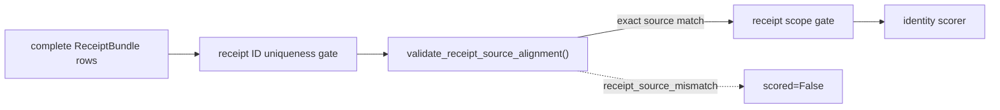

Run the source-mislabel fault:

```bash
uv run python -m examples.security_hardening.detector_harness demo --scenario hardened_authorized --authority-fault mislabel_receipt_source
```

A clean result means only that every supplied receipt carried a `source` exactly equal to one caller-supplied `expected_source`. Both the row `source` values and the expected value are producer-controlled, so agreement between them is coherence, not provenance: a fully consistent bundle can still be fabricated. It does not authenticate receipts, sources, or the expected value; prove that the receipts originated from the named source; establish alignment across bundles, runs, or sources; dereference or correlate source labels against any external system; prove receipt coverage or that omitted receipts do not exist; or make the same-user authority subprocess a trust boundary. Case, whitespace, and Unicode normalization remain caller policy.

## Receipt ID Uniqueness Validation Follow-On

`codex/security-receipt-id-uniqueness` adds the public opt-in `ReceiptIdUniquenessValidation` helper and wires one detector-side `receipt_id_uniqueness_gated_scorer()` wrapper into the identity-approval profile after receipt-bundle completeness and before receipt scope or profile policy. One `duplicate_receipt_id` authority fault copies an issued receipt before bundle write while keeping `declared_receipt_count` coherent, so the detector reaches the new intrinsic row-ID gate instead of confusing the case with transport or scope drift.

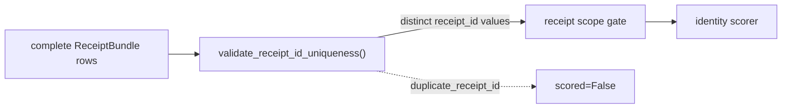

Run the duplicate-ID fault:

```bash
uv run python -m examples.security_hardening.detector_harness demo --scenario hardened_authorized --authority-fault duplicate_receipt_id
```

A clean uniqueness result means only that no two supplied receipts in one materialized iterable shared a `receipt_id`. It does not authenticate receipts, sources, or identifiers; prove that distinct identifiers denote distinct receipts, or that a duplicate identifier denotes a dishonest collector rather than a construction bug; establish uniqueness across bundles, runs, or sources; dereference or correlate identifiers against any external system; prove receipt coverage or that omitted receipts do not exist; or make the same-user authority subprocess a trust boundary.

## Finding Required Evidence Ref Follow-On

`codex/security-finding-required-evidence-ref` adds the public opt-in `FindingRequiredEvidenceRefValidation` helper and wires its first supervisor-side consumer after finding scope, report coherence, and ID uniqueness have already passed. The supervisor uses its own selected `input_id` as the required exact ref, not the detector report's echoed field, and now also refuses a report whose `detector_input_id` drifts from that selected value before it admits any finding rows.

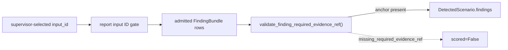

Run the new supervisor-visible finding fault:

```bash
uv run python -m examples.security_hardening.detector_harness demo --scenario vulnerable_attack --detector-fault drop_required_evidence_ref
```

This is a visible anchor-presence gate, not provenance or authenticity. A detector receives the supervisor-selected `input_id` and can echo it mechanically; the helper does not prove the finding derives from that input, that any cited ref resolves to real evidence, that other refs are sufficient, or that detector coverage is complete. The example refusal string includes raw input and finding identifiers that a real deployment may need to redact.

## Finding Evidence-Ref Membership Follow-On

`codex/security-finding-evidence-ref-membership` adds the public opt-in `FindingEvidenceRefValidation` helper and wires one detector-side `evidence_ref_membership_gated_scorer()` wrapper into both example profiles. The wrapper builds one allowed-ID set from the current `DetectorInput.input_id`, effect IDs, and receipt IDs, then refuses a scorer result that cites any other exact string before the finding bundle is written.

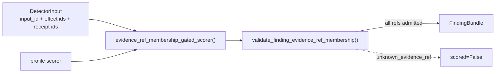

The wrapper is scorer conformance inside one detector process, not a supervisor trust boundary. It does not authenticate the scorer, finding rows, evidence IDs, or allowed set; dereference evidence; prove that a present reference supports a finding; require a finding to cite any evidence at all; prove detector coverage; or enforce that every finding cites the supervisor-selected `input_id`. That last required-ref question is a different possible future gate because the supervisor independently knows `input_id`, while this membership helper only checks for invented refs relative to the detector input it receives.

## Finding Admission Diagnostics Follow-On

`codex/security-finding-admission-diagnostics` adds no public `nooa.security` API. The example-local `DetectorReport` now carries one supervisor-owned `finding_admission_refusal` field for the existing finding count, scope, refused-report-row, and ID-uniqueness refusal stages. The supervisor clears any child-supplied value on report admission, then sets the field only when one of those later finding-admission gates fails.

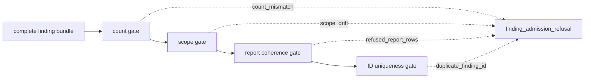

Run representative existing faults:

```bash
uv run python -m examples.security_hardening.detector_harness demo --scenario vulnerable_attack --detector-fault drop_finding_count_mismatch
uv run python -m examples.security_hardening.detector_harness demo --scenario vulnerable_attack --detector-fault stale_finding_run_id
uv run python -m examples.security_hardening.detector_harness demo --scenario vulnerable_attack --detector-fault duplicate_finding_id
```

This is observability for the example supervisor, not a trust upgrade. The field does not authenticate detector output, findings, producers, identifiers, or refusal text; add a new finding gate; validate evidence references; prove coverage; or make same-user child processes trustworthy.

## Finding ID Uniqueness Validation Follow-On

`codex/security-finding-id-uniqueness` adds the public opt-in `FindingIdUniquenessValidation` helper and wires it into the example supervisor after finding-bundle completeness, count coherence, finding-scope, and report-coherence checks. Existing scope and report-coherence refusals retain precedence; ID uniqueness runs only after those checks pass. One `duplicate_finding_id` fault duplicates a scored row while keeping `declared_finding_count` coherent, so the supervisor reaches the new intrinsic row-ID gate instead of confusing the case with transport or scope drift.

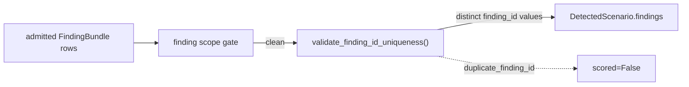

Run the duplicate-ID fault:

```bash
uv run python -m examples.security_hardening.detector_harness demo --scenario vulnerable_attack --detector-fault duplicate_finding_id
```

A clean uniqueness result means only that no two admitted rows in one `FindingBundle` shared a `finding_id`. It does not authenticate rows, producers, or identifiers; prove that distinct identifiers denote distinct findings, or that a duplicate identifier denotes a dishonest producer rather than a scorer bug; establish uniqueness across bundles, runs, or producers; dereference or correlate identifiers against any external system; prove detector coverage or that omitted findings do not exist; or make the same-user detector subprocess a trust boundary.

## Receipt Bundle Version Contract Follow-On

`codex/security-receipt-bundle-version-contract` publishes the version-token rule that `read_receipt_bundle()` already uses internally. A compatible reader can now apply `RECEIPT_BUNDLE_SCHEMA_VERSION_PATTERN` with `RECEIPT_BUNDLE_SCHEMA_VERSION_PATTERN_MATCH_MODE == "full"` to distinguish a malformed token from a well-formed but unsupported future receipt-bundle version without reverse-engineering a private regex.

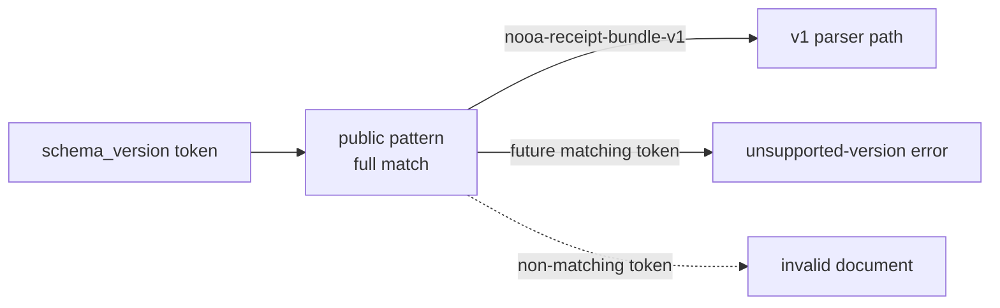

This is a conformance contract, not a trust claim. The pattern does not authenticate bytes, guarantee support for a matching future version, make malformed content recoverable, or change the current reader behavior.

## Finding Bundle Conformance Vectors Follow-On

`codex/security-finding-bundle-conformance-vectors` adds checked reference vectors for the public finding-bundle transport without changing `src/nooa/**`. The fixture pins representative `write_finding_bundle()` bytes, including LF termination, ordered keys, compact UTF-8 encoding, and multi-finding arrays, then exercises `read_finding_bundle()` against selected clean, over-bound, invalid UTF-8, malformed, and version-classified documents.

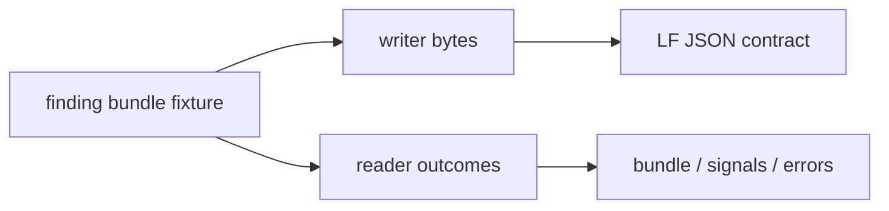

These vectors are regression references, not a trust claim. A byte-conforming bundle can still be forged or semantically false, a clean result still does not prove detector coverage, and independent writers remain free to use different accepted JSON formatting.

## Finding Bundle Handoff Follow-On

`codex/security-finding-bundle-handoff` adds the public `FindingBundle` transport and moves detector rows out of the example-local `DetectorReport` JSON. The detector emits report metadata on stdout with `declared_finding_count`, writes one LF-terminated bundle through a dedicated inherited descriptor backed by a supervisor-owned temporary file, and the supervisor accepts rows only after bundle completeness, cross-channel count, and finding-scope gates all pass. A refused parsed report keeps its detector-declared count as diagnostic metadata even though `DetectedScenario.findings` stays empty.

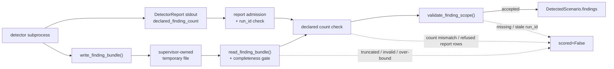

Run the new finding transport faults:

```bash
uv run python -m examples.security_hardening.detector_harness demo --scenario vulnerable_attack --detector-fault truncate_finding_document
uv run python -m examples.security_hardening.detector_harness demo --scenario vulnerable_attack --detector-fault drop_finding_count_mismatch
```

The temporary file is a liveness choice for the example: the detector can finish its bundle write before the supervisor reads it, without a second stdout protocol or pipe backpressure. It is not a trust boundary. A clean bundle is only one terminated document with supplied rows; it is not a verdict, severity model, enforcement action, detector-coverage proof, finding-id uniqueness guarantee, or evidence-reference validator. `FindingBundle.producer` is a caller assertion and does not constrain row-level `SecurityFinding.producer`; an empty clean bundle is not evidence that nothing was found.

## Supervisor Output Admission Follow-On

`codex/security-supervisor-output-admission` completes the detector harness supervisor's example-local parse boundary without adding a public `nooa.security` API. The supervisor now admits victim summary JSON, authority summary JSON, and detector report JSON through separate bounded checks after `communicate()` returns. Detector report parse failures reuse its existing `scored=False` refusal channel; victim and authority summary failures raise `SupervisorAdmissionError` before the harness builds `DetectedScenario`. The victim summary path also rejects visible drift in the echoed `scenario` field.

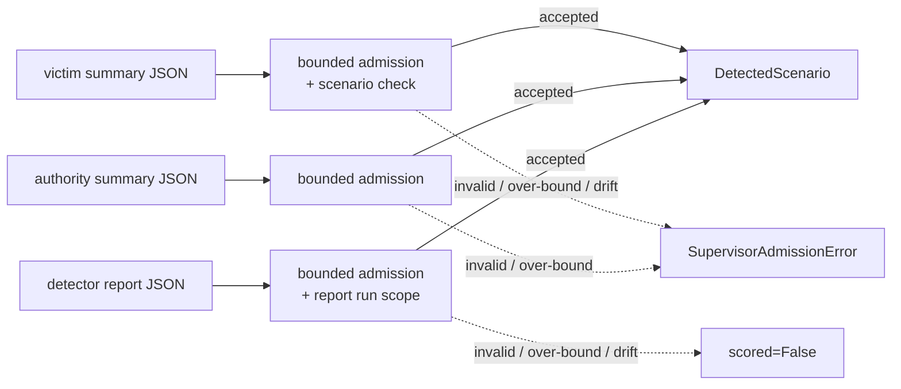

Run representative admission faults:

```bash
uv run python -m examples.security_hardening.detector_harness demo --scenario vulnerable_attack --subprocess-output-fault malformed_detector_report
uv run python -m examples.security_hardening.detector_harness demo --scenario vulnerable_attack --subprocess-output-fault stale_victim_scenario
```

Unlike `victim_fault`, `authority_fault`, and `detector_fault`, which configure child behavior, `subprocess_output_fault` mutates already-collected stdout supervisor-side after `communicate()` and the returncode checks so the example can exercise the admission boundary against lying-child-shaped payloads.

This is example hardening, not child authentication. All three payloads remain subprocess-controlled; a well-formed lie still passes these shape and scope checks. The three byte limits are parse-admission checks after `communicate()` already collected stdout, not pre-read memory limits, and `DetectorReport`, `VictimSummary`, `AuthoritySummary`, and `DetectedScenario` remain example artifacts rather than stable NOOA transport schemas.

## Finding Scope Gate Follow-On

`codex/security-finding-scope-gate` adds the opt-in finding scope helper and uses it at the supervisor side of the detector handoff. On the current branch, the later Finding Bundle Handoff above moves rows out of `DetectorReport` JSON: before `run_detected_scenario()` accepts them, the supervisor admits report metadata, reads the separate `FindingBundle`, checks the report `run_id`, and refuses blank-scoped or stale-scoped `SecurityFinding` rows against the supervisor-selected scope.

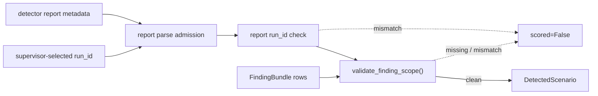

Run the new detector fault:

```bash
uv run python -m examples.security_hardening.detector_harness demo --scenario vulnerable_attack --detector-fault stale_finding_run_id
```

`blank_finding_run_id` exercises the other visible scope signal on the same finding-producing scenario. Both finding faults require a scored report with at least one finding; the harness fails explicitly instead of silently ignoring them on a zero-finding scenario.

This is a visible scope-consistency gate, not a trusted detector. Directly constructing `FindingScopeValidation` asserts diagnostics; it does not perform the check. The supervisor-side `max_detector_report_bytes` option bounds only payload admitted to parsing after `communicate()` already collected stdout, so it is not a pre-read memory limit. The helper and example do not authenticate finding producers or the caller-selected scope, prove detector coverage, check finding-id uniqueness, dereference evidence refs, assign severity or verdict, or make an empty clean bundle evidence that no findings exist.

## Receipt Bundle Conformance Vectors Follow-On

`codex/security-receipt-bundle-conformance-vectors` adds checked reference vectors for the public receipt-bundle transport without changing `src/nooa/**`. The fixture pins representative `write_receipt_bundle()` bytes, including LF termination, ordered keys, compact UTF-8 encoding, multi-receipt arrays, and declared-count mismatch, then exercises `read_receipt_bundle()` against selected clean, over-bound, invalid UTF-8, malformed, and version-classified documents.


These vectors are regression references, not a trust claim. A byte-conforming bundle can still be forged or semantically false, a clean result still does not prove collection completeness, and independent writers remain free to use different accepted JSON formatting.

## Receipt Bundle Transport Follow-On

`codex/security-receipt-bundle-transport` replaces the harness's example-local receipt JSON reader with the public `ReceiptBundle` transport. The authority emits one bounded LF-terminated bundle, the detector reads it through `read_receipt_bundle()`, and `require_complete_receipt_bundle()` refuses a truncated or declared-count-mismatched document before the example reaches receipt run-scope or profile policy.

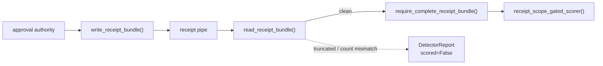

Run the new transport faults:

```bash
uv run python -m examples.security_hardening.detector_harness demo --scenario hardened_authorized --authority-fault truncate_receipt_document
uv run python -m examples.security_hardening.detector_harness demo --scenario hardened_authorized --authority-fault drop_receipt_count_mismatch
```

This closes one transport ambiguity only. A clean bundle means the detector received one terminated document whose declared count matched the receipt copies in that document; it does not authenticate the authority, prove coverage, detect omitted receipts before a truthful count declaration, establish run scope, or turn same-user subprocesses into a trusted boundary.

## Detector Receipt Scope Gate Follow-On

`codex/security-detector-receipt-scope-gate` wires the opt-in receipt scope helper into the example detector subprocess only when the identity profile receives an authority receipt pipe. The harness wraps the identity scorer with the supervisor-selected `run_id`, so an off-run receipt copy is refused before policy instead of disappearing inside the scorer's same-run receipt join. The receipt-free data export profile keeps its direct scorer path.

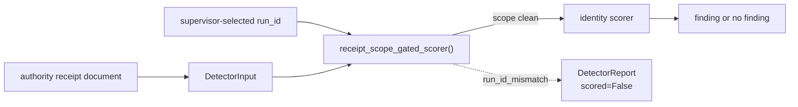

Run the new stale-receipt fault:

```bash
uv run python -m examples.security_hardening.detector_harness demo --scenario hardened_authorized --authority-fault stale_receipt_run_id
```

This follow-on converts one silent off-run drop into a visible refusal. It does not authenticate the receipt source, prove coverage, make `DetectorInput` enforce scope automatically, or protect the refusal text itself; this demo includes raw run and receipt identifiers in the refusal reason, so a real deployment must decide whether that text is allowed to cross its detector boundary.

## Receipt Scope Validation Follow-On

`codex/security-receipt-scope-validation` adds one opt-in core helper for applications that already chose an assessment `run_id` and want to reject supplied receipt copies that are blank-scoped or stale-scoped before they hand them to policy. The helper materializes the receipt iterable once, preserves order, and leaves all identity-specific profile rules in the application layer.

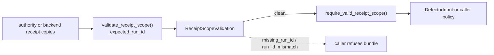

This is a run-scope consistency helper, not a trusted detector. Directly constructing `ReceiptScopeValidation` asserts diagnostics; it does not perform the check. The detector receipt scope gate follow-on above invokes it in one example harness, but `DetectorInput` itself still does not auto-enforce it. The helper does not authenticate the source, prove receipt coverage, check receipt-id uniqueness, inspect profile semantics, correlate a receipt to an effect, or make an empty clean bundle evidence that no receipts exist.

## Minimal Out-of-Process Recipe Follow-On

`codex/security-minimal-out-of-process-recipe` adds a small boundary-first example that sits between the single-process `SURFACE.md` snippet and the full detector harness. The supervisor gives one child only the V2 effect-pipe write end and one child only the effect-pipe read end; the detector child builds `DetectorInput` from public APIs and either emits one example finding or refuses an incomplete stream.

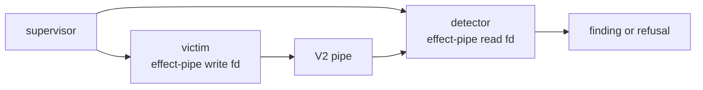

Run the clean and incomplete paths:

```bash
uv run python -m examples.security_hardening.minimal_detector demo
uv run python -m examples.security_hardening.minimal_detector demo --victim-fault exit_between_frames
```

This is a placement recipe, not a trust claim. Same-user subprocesses do not add authentication, sandboxing, attestation, or completeness proof, and the example scorer is intentionally smaller than the application-specific policies in the full harness.

## Transport Conformance Follow-On

`codex/security-transport-conformance-vectors` adds checked JSON vectors for `SecurityReceipt`, `SecurityFinding`, and `DetectorInput` without changing `src/nooa/**`. The vectors pin the current `-v1` writer bytes for defaults, populated shapes, and representative payload encoding, then validate the same fixture bytes back through each public model.

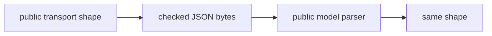

These vectors are interoperability regression references, not a trust claim. A byte-conforming receipt, finding, or detector input can still be forged or semantically false, and the vectors do not add policy semantics to the transport objects.

## Producer Egress Conformance Follow-On

`codex/security-effect-egress-producer-conformance` adds checked writer-direction vectors for the existing `FdEffectSink` V1 and V2 output without changing `src/nooa/**`. The vectors pin the bytes that this implementation emits today, including V2 stream-end counts, and the focused tests feed those same bytes back through `read_effect_egress()` so the producer and reader examples cannot drift independently.

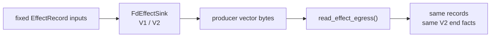

These vectors are interoperability regression references, not an authenticity claim. A conforming writer can still forge records or omit effects before closing, and an external writer can remain acceptable to the reader without copying NOOA's exact JSON formatting.

## Security Review Joint Branch: End-to-End Detector Pipeline V14

`codex/security-hardening-e2e-detector-pipeline-v14` is the current presentation branch for the full example composition. It adds no new runtime API beyond the smaller slices below. The current path keeps application authorization policy outside NOOA, moves detector scoring outside the victim process, uses V2 effect egress plus public receipt and finding bundle transports for reader-visible refusal semantics, publishes both bundle version-token classification rules for independent readers, refuses degraded receipt transport before receipt scope or identity policy runs, refuses repeated `receipt_id` values in one supplied identity receipt iterable before receipt scope or profile policy runs, refuses visible stale authority receipt scope before identity policy runs, checks both profile scorers for evidence refs outside the current `DetectorInput` ID set before finding bundle emission, admits detector report metadata and finding rows through separate supervisor-side gates before accepting output, refuses visible report `detector_input_id` drift, refuses repeated `finding_id` values only after finding scope and report coherence pass, requires every admitted row to cite the supervisor-selected `input_id` after those gates pass, exposes the current finding-admission refusal stage through one example-local structured field, admits every parsed child stdout payload through example-local bounded checks, exercises the same detector handoff across identity approval and data export victims, and carries checked conformance vectors for both bundle boundaries.

```mermaid
flowchart LR
    I["prompt injection<br/>or unsafe task context"] --> V1["identity victim"]
    I --> V2["export victim"]
    V1 --> VS["victim summary JSON"]
    V2 --> VS
    V1 --> A["approval authority<br/>identity only"]
    A --> AS["authority summary JSON"]
    V1 --> EP["V2 effect pipe"]
    V2 --> EP
    A --> RP["ReceiptBundle pipe"]
    EP --> D["detector subprocess"]
    RP --> D
    D --> ER["read_effect_egress()"]
    D --> RR["read_receipt_bundle()<br/>identity only"]
    ER --> DI["DetectorInput"]
    RR --> RG["receipt bundle gate"]
    RG --> DI
    DI --> RI["receipt ID uniqueness gate<br/>identity only"]
    RI --> G["receipt scope gate<br/>identity only"]
    G --> S1["identity scorer"]
    DI --> S2["export scorer"]
    S1 --> EM["evidence ref membership gate<br/>current DetectorInput IDs"]
    S2 --> EM
    EM --> RPT["DetectorReport JSON<br/>declared_finding_count"]
    EM --> FBW["write_finding_bundle()"]
    FBW --> FFT["finding temp file"]
    VS --> VA["victim summary admission<br/>+ scenario check"]
    AS --> AA["authority summary admission"]
    RPT --> RA["detector report admission<br/>+ run_id / input_id checks"]
    FFT --> FBR["read_finding_bundle()<br/>+ completeness gate"]
    RA --> FC["finding count gate"]
    FBR --> FC
    FC --> FG["finding scope gate"]
    FG --> FCG["report coherence gate"]
    FCG --> FU["finding ID uniqueness gate"]
    FU --> FR["required evidence-ref gate<br/>supervisor-selected input_id"]
    VA --> O["DetectedScenario"]
    AA --> O
    FR --> O
    ER -. "gap / truncation / missing end / count mismatch" .-> X["DetectorReport<br/>scored=False"]
    RR -. "truncated / receipt count mismatch" .-> X
    RI -. "duplicate_receipt_id" .-> X
    G -. "receipt run_id mismatch" .-> X
    EM -. "unknown_evidence_ref" .-> X
    RA -. "over-bound / invalid / report run_id / input_id mismatch" .-> X
    FBR -. "truncated / invalid / over-bound" .-> X
    FC -. "count_mismatch" .-> FAD["finding_admission_refusal"]
    FG -. "scope_drift" .-> FAD
    FCG -. "refused_report_rows" .-> FAD
    FU -. "duplicate_finding_id" .-> FAD
    FR -. "missing_required_evidence_ref" .-> FAD
    FAD --> X
    X --> O
    VA -. "over-bound / invalid / scenario drift" .-> Y["SupervisorAdmissionError"]
    AA -. "over-bound / invalid" .-> Y
```

The checked scenario matrix lives in the root [`README.md`](../../README.md#security-review-joint-branch-end-to-end-detector-pipeline-v14). This page keeps the progressive rationale and per-slice details; the root matrix is the single source of truth for runnable joint-branch outcomes. The matrix includes only paths that return `DetectedScenario`; victim and authority summary admission faults remain exception-path coverage in `tests/security/test_detector_harness.py`. The matrix still has no row for detector-side evidence-ref membership because current scorers emit refs within their `DetectorInput`, the current fault axis mutates outputs only after scoring, and the supervisor still has no independent evidence-ID set to recheck membership after bundle admission. V13 adds one row for supervisor-side required-ref presence because `drop_required_evidence_ref` strips the supervisor-selected anchor after scoring and before finding admission. V14 adds one detector-side `duplicate_receipt_id` row because the authority can duplicate a transported receipt after issuance while keeping the bundle count coherent; its `Finding admission refusal` stays `None`, so it joins the malformed-report and stale-receipt-scope pre-finding-admission collision group rather than creating a new supervisor finding-admission stage. The `Finding admission refusal` column still separates count, scope, duplicate-finding-ID, and missing-required-ref failures, and the refused-report-row value remains unit-test-only because no matrix scenario emits that combination.

This is still a same-user, same-host example with no authentication, signing, sandboxing, attestation, production IAM boundary, or completeness proof. Two example victims do not establish general coverage, a valid-looking V2 terminator, receipt bundle, or finding bundle remains only as trustworthy as the boundary that produced it, matching future bundle version tokens are not promises of parser support or safety, count agreement does not prove omitted receipts or findings did not happen, matching receipt or finding `run_id` values are not proof of authenticity, distinct `receipt_id` values, distinct `finding_id` values, evidence-ref membership against a detector input, required-ref presence, and `finding_admission_refusal` do not prove authenticity, provenance, evidence support, or uniqueness across bundles, the detector sees the supervisor-selected `input_id` and can echo it mechanically, the receipt-ID and evidence-ref wrappers are not supervisor gates and a hostile detector can bypass them, the new field is example-local rather than a public NOOA schema, a well-formed victim or authority summary can still lie, the three stdout byte bounds apply only after `communicate()` has already collected stdout, and the finding-bundle bound applies only when the supervisor reads its same-user temporary file.

## V2 Effect Egress Stream-End Follow-On

`codex/security-effect-egress-stream-end-v2` adds an opt-in V2 envelope to the shared egress reader and switches the subprocess collector and detector examples to it. V1 stays the default writer contract. In V2, normal victim completion calls `FdEffectSink.close()` and emits one stream-end frame with a writer-declared record count; EOF between complete frames now surfaces as `missing_stream_end` instead of looking like orderly completion. `codex/security-lossy-writer-fault-coverage` adds example-only sequence-gap and dropped-record faults so the composed detector path also exercises orderly-looking loss diagnostics without changing `src/nooa/**`.

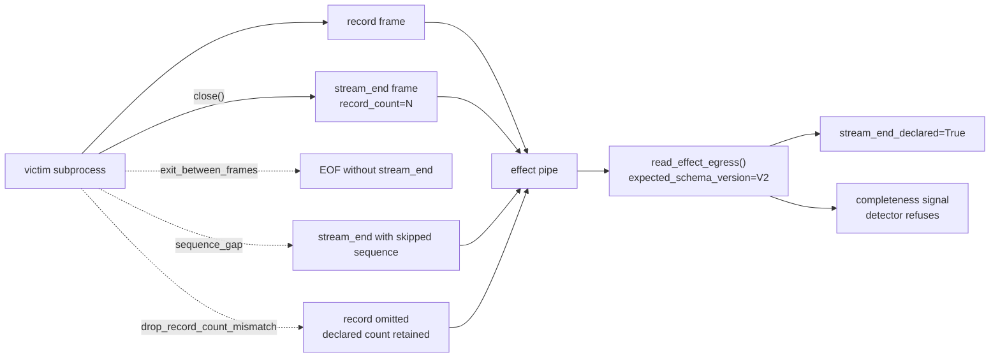

Run the new between-frame failure against both subprocess surfaces:

```bash
uv run python -m examples.security_hardening.effect_collector demo --victim-fault exit_between_frames
uv run python -m examples.security_hardening.effect_collector demo --victim-fault sequence_gap
uv run python -m examples.security_hardening.effect_collector demo --victim-fault drop_record_count_mismatch
uv run python -m examples.security_hardening.detector_harness demo --scenario vulnerable_attack --victim-fault exit_between_frames
uv run python -m examples.security_hardening.detector_harness demo --scenario vulnerable_attack --victim-fault drop_record_count_mismatch
uv run python -m examples.security_hardening.detector_harness demo --scenario export_vulnerable_attack --victim-fault exit_between_frames
```

| Path | Victim fault | Stream end | Completeness signals | Result |
| --- | --- | --- | --- | --- |
| Collector | None | Declared | `()` | Facts preserved |
| Collector | `partial_tail_crash` | Missing | `("truncated", "missing_stream_end")` | Facts preserved |
| Collector | `exit_between_frames` | Missing | `("missing_stream_end",)` | Facts preserved |
| Collector | `sequence_gap` | Declared | `("first_sequence_error",)` | Facts preserved |
| Collector | `drop_record_count_mismatch` | Declared | `("record_count_mismatch",)` | Facts preserved |
| Detector | `exit_between_frames` | Missing | `("missing_stream_end",)` | Refused, not scored |
| Detector | `sequence_gap` | Declared | `("first_sequence_error",)` | Refused, not scored |
| Detector | `drop_record_count_mismatch` | Declared | `("record_count_mismatch",)` | Refused, not scored |

The terminator closes one narrow ambiguity only: it distinguishes a writer that declared completion from a writer that stopped before declaring completion. The new loss faults pin two inconsistent writer states that the reader can already diagnose: a skipped sequence and a declared count larger than the retained record set. They still do not authenticate the writer, prove that all effects were emitted before close, make a forged terminator trustworthy, or change the same-user same-host process limits of these examples. A writer that drops an effect and declares the reduced count remains invisible by construction.

## Second Victim Detector Generality Follow-On

`codex/security-second-victim-detector-generality` adds a second example victim on top of the joint branch without changing `src/nooa/**`. `DataExportAgent.export_dataset()` emits `data.export` effects and uses a backend destination allowlist instead of approval tokens. Its scorer still requires complete effect egress, but it intentionally scores with `receipts=()` and `receipt_coverage="unknown"` because receipt sufficiency belongs to application policy, not the `DetectorInput` transport object.

```mermaid
flowchart LR
    I1["grant request"] --> V1["IdentityApprovalAgent"]
    I2["export request"] --> V2["DataExportAgent"]
    V1 --> EP["effect pipe"]
    V2 --> EP
    A["approval authority<br/>identity only"] --> RP["receipt pipe"]
    EP --> D["shared detector subprocess"]
    RP --> D
    D --> SF["score_fd()"]
    SF --> DI["detector_input_from_egress()"]
    DI --> IS["identity scorer<br/>receipt coverage required"]
    DI --> ES["export scorer<br/>receipt coverage ignored"]
```

Run the receipt-free export attack and hardened replay:

```bash
uv run python -m examples.security_hardening.detector_harness demo --scenario export_vulnerable_attack
uv run python -m examples.security_hardening.detector_harness demo --scenario export_hardened_attack
uv run python -m examples.security_hardening.detector_harness demo --scenario export_hardened_allowed
```

| Scenario | Backend policy | Authority | Receipt coverage | Finding |
| --- | --- | --- | --- | --- |
| `export_vulnerable_attack` | Allowlist off | None | `unknown` | 1 |
| `export_hardened_attack` | Allowlist on | None | `unknown` | 0 |
| `export_hardened_allowed` | Allowlist on | None | `unknown` | 0 |

The branch demonstrates only that the current handoff stretched once beyond identity approval. It does not prove that two victims cover agent method shapes generally, make the allowlist a NOOA policy API, or change the same-user, same-host trust limits of the detector harness. The export scorer and identity scorer are intentionally separate application policies: the export scorer ignores grant effects, while the identity scorer either ignores or refuses export inputs rather than treating them as grants.

## Out-of-Process Collector Follow-On

`codex/security-hardening-e2e-defender-provenance-egress-contract-collector` adds an example-only supervisor harness around the same identity victim. The supervisor opens one pipe, passes only the write end to the victim subprocess, passes only the read end to the collector subprocess, and joins the collector summary with the victim return code. The collector stays fact-reporting and does not call `require_complete_effect_egress()` so it can preserve truncated or gapped stream diagnostics for the supervisor.

```mermaid
flowchart LR
    S["supervisor"] -- "pipe read fd only" --> C["collector subprocess"]
    S -- "pipe write fd only" --> V["victim subprocess"]
    I["prompt injection<br/>or unsafe task context"] --> A
    V --> A["IdentityApprovalAgent"]
    A --> E["FdEffectSink"]
    E --> P["pipe"]
    P --> C
    C --> R["CollectorSummary<br/>records + stream facts"]
    V --> VX["victim returncode"]
    R --> J["CollectedScenario"]
    VX --> J
```

Run the subprocess demo with:

```bash
uv run python -m examples.security_hardening.effect_collector demo
```

To carry one framework guard-shaped record across the same pipe and show that
the collector still sees distinct `observer` labels, use the example-local
coverage knob:

```bash
uv run python -m examples.security_hardening.effect_collector demo --scenario defender_only_attack --emit-guard-effect
```

That optional path adds one validation-denial record after the identity
decision. It demonstrates label separation across the subprocess boundary; it
does not turn either record into a detector verdict.

The example exposes four fault-injection modes after a real agent effect: one writes a partial trailing frame before exiting, one exits between complete frames before the V2 terminator, one skips a sequence before a valid terminator, and one drops a record while declaring the pre-loss count. The supervisor returns those stream facts beside the victim outcome:

```bash
uv run python -m examples.security_hardening.effect_collector demo --victim-fault partial_tail_crash
uv run python -m examples.security_hardening.effect_collector demo --victim-fault exit_between_frames
uv run python -m examples.security_hardening.effect_collector demo --victim-fault sequence_gap
uv run python -m examples.security_hardening.effect_collector demo --victim-fault drop_record_count_mismatch
```

This is a real but narrow boundary improvement: the victim subprocess cannot read back bytes after it writes them into the pipe, and the pipe is not a seekable output file it can truncate. `CollectorSummary` reports the records that arrived, the first sequence discontinuity, whether the final frame was truncated, and the V2 stream-end declaration plus declared count. `truncated=False` alone means only that the received byte stream ended between frames. `stream_end_declared=True` means only that the writer emitted a valid-looking V2 terminator; neither fact means the record set is authentic or complete.

The collector path carries effect records and victim status only. It does not move `DetectorInput`, receipts, findings, or the same-process demo's incomplete-stream scoring refusal into the subprocess boundary. The collector still accepts a valid-looking forged frame or forged V2 terminator from any writer holding the write end, and a writer can still omit an effect before emitting a terminator. Its shared reader byte and record budgets are local resource backstops, not authenticity guarantees. These are same-user, same-host processes with no privilege boundary between them; this branch demonstrates descriptor separation and writer-declared completion, not sandboxing, attestation, prevention, or a detector verdict. It keeps process lifecycle in the example instead of adding another core NOOA collector API.

## Detector Subprocess Harness Follow-On

`codex/security-trusted-detector-harness` adds an example-only detector process on top of the collector-facing contract. The supervisor gives the victim only the effect write end, gives the detector only the effect read end plus a separate receipt read end, writes one bounded `DetectorReceiptDocument`, and lets the detector construct `DetectorInput` itself before running the existing identity scorer.

```mermaid
flowchart LR
    S["supervisor"] -- "effect write fd only" --> V["victim subprocess"]
    S -- "receipt document<br/>bounded JSON" --> RP["receipt pipe"]
    V --> EP["effect pipe"]
    EP -- "effect read fd only" --> D["detector subprocess"]
    RP -- "receipt read fd only" --> D
    D --> DI["DetectorInput<br/>require_complete=False"]
    DI --> P["identity scorer"]
    P -- "scoreable" --> F["SecurityFinding rows"]
    P -- "gap / truncation / missing stream end / unknown coverage" --> X["DetectorReport<br/>scored=False"]
```

Run a vulnerable replay that produces one out-of-process finding:

```bash
uv run python -m examples.security_hardening.detector_harness demo --scenario vulnerable_attack
```

Run the same victim with a partial trailing frame or with EOF between complete frames to see the detector preserve a refusal instead of reporting a clean zero-finding result:

```bash
uv run python -m examples.security_hardening.detector_harness demo --scenario vulnerable_attack --victim-fault partial_tail_crash
uv run python -m examples.security_hardening.detector_harness demo --scenario vulnerable_attack --victim-fault exit_between_frames
```

The authorized scenario uses one supervisor-issued receipt document so the detector can demonstrate the no-finding path:

```bash
uv run python -m examples.security_hardening.detector_harness demo --scenario hardened_authorized
```

This is a placement demo, not a trust claim. The detector is outside the victim process, but it still shares the same user and host; a compromised supervisor compromises both children. The receipt document exists so the example can exercise the receipt-aware path deterministically. It is not a backend audit export, and `receipt_coverage="asserted_complete"` remains a supervisor assertion that the detector does not verify. The receipt byte cap is a local resource backstop, not authenticity or authorization. Findings emitted outside the victim are not automatically more authentic than findings emitted inside it, and a valid-looking V2 stream-end frame still does not prove that the writer emitted every effect before close. The harness assembles `DetectorInput` inside the detector; it does not define a byte-level `DetectorInput` wire protocol. `DetectorReceiptDocument`, `DetectorReport`, and `DetectedScenario` stay in the example rather than becoming NOOA core schemas.

## Approval Authority Receipt Follow-On

`codex/security-approval-authority-receipts` removes the supervisor's scenario-based receipt synthesis from the detector harness. The shared `AUTHORIZED_REQUEST` fixture is now tokenless. In the subprocess path, the victim sends one bounded approval request document to a separate example authority, receives a deterministic run-scoped token response, and only then calls the backend configured for that same run scope. The authority writes one bounded `AuthorityReceiptDocument` directly to the detector, so the detector's clean authorized verdict rests on an issuance that happened rather than on a supervisor branch that already knew the scenario name.

```mermaid
flowchart LR
    S["supervisor"] --> V["victim subprocess"]
    V -- "ApprovalRequestDocument" --> A["approval authority<br/>fixed demo allowlist"]
    A -- "ApprovalResponseDocument<br/>token or denial" --> V
    V --> B["identity backend"]
    V -- "effect write fd only" --> EP["effect pipe"]
    A -- "AuthorityReceiptDocument<br/>issued_token_count" --> RP["receipt pipe"]
    EP -- "effect read fd only" --> D["detector subprocess"]
    RP -- "receipt read fd only" --> D
    D --> DI["DetectorInput<br/>require_complete=False"]
    DI --> P["identity scorer"]
    P -- "scoreable" --> F["SecurityFinding rows"]
    P -- "gap / truncation / missing stream end / unknown coverage" --> X["DetectorReport<br/>scored=False"]
```

Run the unapproved replay: the authority sees one request, issues zero tokens and zero receipts, and the detector emits one finding.

```bash
uv run python -m examples.security_hardening.detector_harness demo --scenario vulnerable_attack
```

Run the authorized replay: the authority issues one token plus one receipt, the backend allows the request, and the detector emits zero findings.

```bash
uv run python -m examples.security_hardening.detector_harness demo --scenario hardened_authorized
```

Run the authority failure path: the victim can still receive its response, but the supervisor exits non-zero and names the authority failure instead of treating a missing receipt document as a clean detector result.

```bash
uv run python -m examples.security_hardening.detector_harness demo --scenario hardened_authorized --authority-fault exit_before_receipt
```

This remains a placement and causality demo, not a trust claim. The authority, victim, and detector are same-user, same-host processes with no authentication, signing, sandboxing, or privilege boundary. A receipt says only that the example authority issued a token; it does not prove the backend honored it, prove the effect occurred, or make the detector's finding authentic. `receipt_coverage="asserted_complete"` now means that the authority claims it enumerated every token it issued for this run, and `issued_token_count` is a self-reported consistency check from the same process that wrote the receipts; neither is independently verified. The fixed allowlist and deterministic run-scoped token derivation are demo policy and regression aids, not an IAM model or secret-bearing protocol. The detector can now reject EOF without a V2 terminator, but it still cannot prove that a writer did not omit an effect before emitting a valid-looking terminator, and the harness still does not define a byte-level `DetectorInput` wire protocol.
