# Identity Approval Hardening Flow

This offline example shows how the security review slices compose around one identity-changing agent method. It starts after untrusted content has influenced a victim agent to call `grant_access`, then separates observed effect telemetry, a deterministic application-owned defender recipe, backend receipt collection, a detector-facing `DetectorInput` handoff, and application-local finding generation. Each scenario assigns one `run_id` to its detector input, out-of-band receipts, and findings so this narrow scorer can ignore a stale receipt from another run.

For the consolidated export map, V1/V2 egress rules, minimal integration, and canonical trust-boundary statements, see [`SURFACE.md`](SURFACE.md).

## Reading Order

1. Start with [`SURFACE.md`](SURFACE.md) for the public `nooa.security` export map and the minimal single-process API path.
2. Run [`minimal_detector.py`](minimal_detector.py) for the focused two-process boundary path that keeps `DetectorInput` construction on the detector side.
3. Move to [`detector_harness.py`](detector_harness.py) for the full example composition with victim profiles, approval receipts, and refusal scenarios.

## Finding Scope Gate Follow-On

`codex/security-finding-scope-gate` adds the opt-in finding scope helper and uses it at the supervisor side of the detector-report handoff. The detector still emits an ordinary `DetectorReport`; before `run_detected_scenario()` accepts that report, the supervisor admits only a bounded payload to parsing, checks the report `run_id`, and refuses blank-scoped or stale-scoped `SecurityFinding` rows against the supervisor-selected scope.

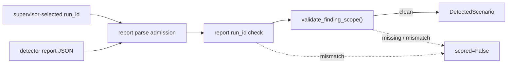

Run the new detector fault:

```bash
uv run python -m examples.security_hardening.detector_harness demo --scenario vulnerable_attack --detector-fault stale_finding_run_id
```

`blank_finding_run_id` exercises the other visible scope signal on the same finding-producing scenario. Both finding faults require a scored report with at least one finding; the harness fails explicitly instead of silently ignoring them on a zero-finding scenario.

This is a visible scope-consistency gate, not a trusted detector. Directly constructing `FindingScopeValidation` asserts diagnostics; it does not perform the check. The supervisor-side `max_detector_report_bytes` option bounds only payload admitted to parsing after `communicate()` already collected stdout, so it is not a pre-read memory limit. The helper and example do not authenticate finding producers or the caller-selected scope, prove detector coverage, check finding-id uniqueness, dereference evidence refs, assign severity or verdict, or make an empty clean bundle evidence that no findings exist.

## Receipt Bundle Conformance Vectors Follow-On

`codex/security-receipt-bundle-conformance-vectors` adds checked reference vectors for the public receipt-bundle transport without changing `src/nooa/**`. The fixture pins representative `write_receipt_bundle()` bytes, including LF termination, ordered keys, compact UTF-8 encoding, multi-receipt arrays, and declared-count mismatch, then exercises `read_receipt_bundle()` against selected clean, over-bound, invalid UTF-8, malformed, and version-classified documents.


These vectors are regression references, not a trust claim. A byte-conforming bundle can still be forged or semantically false, a clean result still does not prove collection completeness, and independent writers remain free to use different accepted JSON formatting.

## Receipt Bundle Transport Follow-On

`codex/security-receipt-bundle-transport` replaces the harness's example-local receipt JSON reader with the public `ReceiptBundle` transport. The authority emits one bounded LF-terminated bundle, the detector reads it through `read_receipt_bundle()`, and `require_complete_receipt_bundle()` refuses a truncated or declared-count-mismatched document before the example reaches receipt run-scope or profile policy.

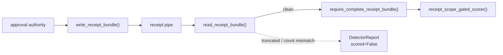

Run the new transport faults:

```bash
uv run python -m examples.security_hardening.detector_harness demo --scenario hardened_authorized --authority-fault truncate_receipt_document
uv run python -m examples.security_hardening.detector_harness demo --scenario hardened_authorized --authority-fault drop_receipt_count_mismatch
```

This closes one transport ambiguity only. A clean bundle means the detector received one terminated document whose declared count matched the receipt copies in that document; it does not authenticate the authority, prove coverage, detect omitted receipts before a truthful count declaration, establish run scope, or turn same-user subprocesses into a trusted boundary.

## Detector Receipt Scope Gate Follow-On

`codex/security-detector-receipt-scope-gate` wires the opt-in receipt scope helper into the example detector subprocess only when the identity profile receives an authority receipt pipe. The harness wraps the identity scorer with the supervisor-selected `run_id`, so an off-run receipt copy is refused before policy instead of disappearing inside the scorer's same-run receipt join. The receipt-free data export profile keeps its direct scorer path.

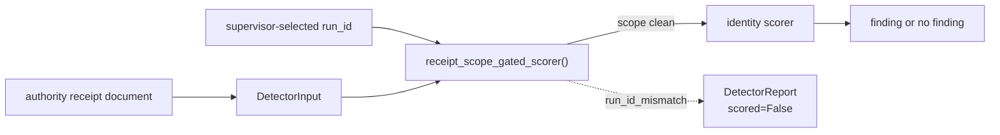

Run the new stale-receipt fault:

```bash
uv run python -m examples.security_hardening.detector_harness demo --scenario hardened_authorized --authority-fault stale_receipt_run_id
```

This follow-on converts one silent off-run drop into a visible refusal. It does not authenticate the receipt source, prove coverage, make `DetectorInput` enforce scope automatically, or protect the refusal text itself; this demo includes raw run and receipt identifiers in the refusal reason, so a real deployment must decide whether that text is allowed to cross its detector boundary.

## Receipt Scope Validation Follow-On

`codex/security-receipt-scope-validation` adds one opt-in core helper for applications that already chose an assessment `run_id` and want to reject supplied receipt copies that are blank-scoped or stale-scoped before they hand them to policy. The helper materializes the receipt iterable once, preserves order, and leaves all identity-specific profile rules in the application layer.

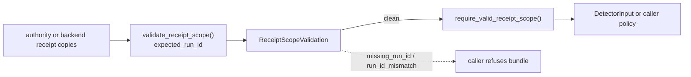

This is a run-scope consistency helper, not a trusted detector. Directly constructing `ReceiptScopeValidation` asserts diagnostics; it does not perform the check. The detector receipt scope gate follow-on above invokes it in one example harness, but `DetectorInput` itself still does not auto-enforce it. The helper does not authenticate the source, prove receipt coverage, check receipt-id uniqueness, inspect profile semantics, correlate a receipt to an effect, or make an empty clean bundle evidence that no receipts exist.

## Minimal Out-of-Process Recipe Follow-On

`codex/security-minimal-out-of-process-recipe` adds a small boundary-first example that sits between the single-process `SURFACE.md` snippet and the full detector harness. The supervisor gives one child only the V2 effect-pipe write end and one child only the effect-pipe read end; the detector child builds `DetectorInput` from public APIs and either emits one example finding or refuses an incomplete stream.

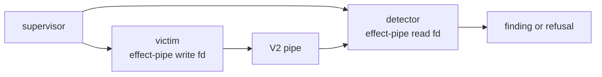

Run the clean and incomplete paths:

```bash
uv run python -m examples.security_hardening.minimal_detector demo
uv run python -m examples.security_hardening.minimal_detector demo --victim-fault exit_between_frames
```

This is a placement recipe, not a trust claim. Same-user subprocesses do not add authentication, sandboxing, attestation, or completeness proof, and the example scorer is intentionally smaller than the application-specific policies in the full harness.

## Transport Conformance Follow-On

`codex/security-transport-conformance-vectors` adds checked JSON vectors for `SecurityReceipt`, `SecurityFinding`, and `DetectorInput` without changing `src/nooa/**`. The vectors pin the current `-v1` writer bytes for defaults, populated shapes, and representative payload encoding, then validate the same fixture bytes back through each public model.

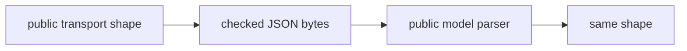

These vectors are interoperability regression references, not a trust claim. A byte-conforming receipt, finding, or detector input can still be forged or semantically false, and the vectors do not add policy semantics to the transport objects.

## Producer Egress Conformance Follow-On

`codex/security-effect-egress-producer-conformance` adds checked writer-direction vectors for the existing `FdEffectSink` V1 and V2 output without changing `src/nooa/**`. The vectors pin the bytes that this implementation emits today, including V2 stream-end counts, and the focused tests feed those same bytes back through `read_effect_egress()` so the producer and reader examples cannot drift independently.

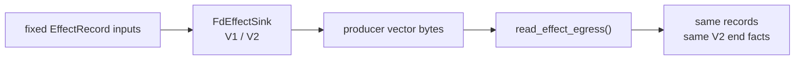

These vectors are interoperability regression references, not an authenticity claim. A conforming writer can still forge records or omit effects before closing, and an external writer can remain acceptable to the reader without copying NOOA's exact JSON formatting.

## Security Review Joint Branch: End-to-End Detector Pipeline V6

`codex/security-hardening-e2e-detector-pipeline-v6` is the current presentation branch for the full example composition. It adds no new runtime API beyond the smaller slices below. The current path keeps application authorization policy outside NOOA, moves detector scoring outside the victim process, uses V2 effect egress plus public receipt-bundle transport for reader-visible refusal semantics, refuses degraded receipt transport before receipt scope or identity policy runs, refuses visible stale authority receipt scope before identity policy runs, validates detector-report and finding scope at the supervisor boundary before accepting detector output, exercises the same detector handoff across identity approval and data export victims, and carries checked receipt-bundle conformance vectors for the new transport boundary.

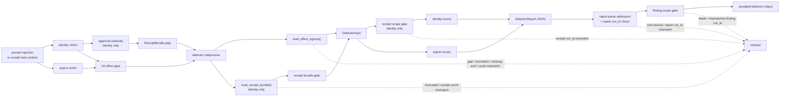

The checked scenario matrix lives in the root [`README.md`](../../README.md#security-review-joint-branch-end-to-end-detector-pipeline-v6). This page keeps the progressive rationale and per-slice details; the root matrix is the single source of truth for runnable joint-branch outcomes.

This is still a same-user, same-host example with no authentication, signing, sandboxing, attestation, production IAM boundary, or completeness proof. Two example victims do not establish general coverage, a valid-looking V2 terminator or receipt bundle remains only as trustworthy as the boundary that produced it, count agreement does not prove omitted receipts did not happen, matching receipt or finding `run_id` values are not proof of authenticity, and the detector-report byte bound applies only after `communicate()` has already collected stdout.

## V2 Effect Egress Stream-End Follow-On

`codex/security-effect-egress-stream-end-v2` adds an opt-in V2 envelope to the shared egress reader and switches the subprocess collector and detector examples to it. V1 stays the default writer contract. In V2, normal victim completion calls `FdEffectSink.close()` and emits one stream-end frame with a writer-declared record count; EOF between complete frames now surfaces as `missing_stream_end` instead of looking like orderly completion. `codex/security-lossy-writer-fault-coverage` adds example-only sequence-gap and dropped-record faults so the composed detector path also exercises orderly-looking loss diagnostics without changing `src/nooa/**`.

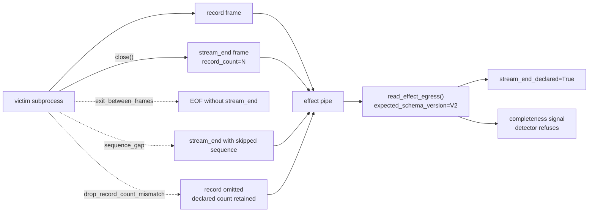

Run the new between-frame failure against both subprocess surfaces:

```bash
uv run python -m examples.security_hardening.effect_collector demo --victim-fault exit_between_frames
uv run python -m examples.security_hardening.effect_collector demo --victim-fault sequence_gap
uv run python -m examples.security_hardening.effect_collector demo --victim-fault drop_record_count_mismatch
uv run python -m examples.security_hardening.detector_harness demo --scenario vulnerable_attack --victim-fault exit_between_frames
uv run python -m examples.security_hardening.detector_harness demo --scenario vulnerable_attack --victim-fault drop_record_count_mismatch
uv run python -m examples.security_hardening.detector_harness demo --scenario export_vulnerable_attack --victim-fault exit_between_frames
```

| Path | Victim fault | Stream end | Completeness signals | Result |
| --- | --- | --- | --- | --- |
| Collector | None | Declared | `()` | Facts preserved |
| Collector | `partial_tail_crash` | Missing | `("truncated", "missing_stream_end")` | Facts preserved |
| Collector | `exit_between_frames` | Missing | `("missing_stream_end",)` | Facts preserved |
| Collector | `sequence_gap` | Declared | `("first_sequence_error",)` | Facts preserved |
| Collector | `drop_record_count_mismatch` | Declared | `("record_count_mismatch",)` | Facts preserved |
| Detector | `exit_between_frames` | Missing | `("missing_stream_end",)` | Refused, not scored |
| Detector | `sequence_gap` | Declared | `("first_sequence_error",)` | Refused, not scored |
| Detector | `drop_record_count_mismatch` | Declared | `("record_count_mismatch",)` | Refused, not scored |

The terminator closes one narrow ambiguity only: it distinguishes a writer that declared completion from a writer that stopped before declaring completion. The new loss faults pin two inconsistent writer states that the reader can already diagnose: a skipped sequence and a declared count larger than the retained record set. They still do not authenticate the writer, prove that all effects were emitted before close, make a forged terminator trustworthy, or change the same-user same-host process limits of these examples. A writer that drops an effect and declares the reduced count remains invisible by construction.

## Second Victim Detector Generality Follow-On

`codex/security-second-victim-detector-generality` adds a second example victim on top of the joint branch without changing `src/nooa/**`. `DataExportAgent.export_dataset()` emits `data.export` effects and uses a backend destination allowlist instead of approval tokens. Its scorer still requires complete effect egress, but it intentionally scores with `receipts=()` and `receipt_coverage="unknown"` because receipt sufficiency belongs to application policy, not the `DetectorInput` transport object.

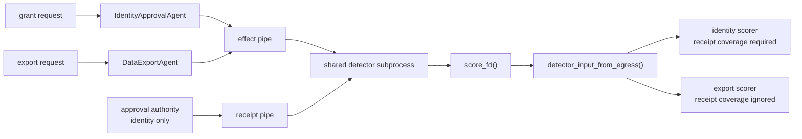

Run the receipt-free export attack and hardened replay:

```bash
uv run python -m examples.security_hardening.detector_harness demo --scenario export_vulnerable_attack
uv run python -m examples.security_hardening.detector_harness demo --scenario export_hardened_attack
uv run python -m examples.security_hardening.detector_harness demo --scenario export_hardened_allowed
```

| Scenario | Backend policy | Authority | Receipt coverage | Finding |
| --- | --- | --- | --- | --- |
| `export_vulnerable_attack` | Allowlist off | None | `unknown` | 1 |
| `export_hardened_attack` | Allowlist on | None | `unknown` | 0 |
| `export_hardened_allowed` | Allowlist on | None | `unknown` | 0 |

The branch demonstrates only that the current handoff stretched once beyond identity approval. It does not prove that two victims cover agent method shapes generally, make the allowlist a NOOA policy API, or change the same-user, same-host trust limits of the detector harness. The export scorer and identity scorer are intentionally separate application policies: the export scorer ignores grant effects, while the identity scorer either ignores or refuses export inputs rather than treating them as grants.

## Out-of-Process Collector Follow-On

`codex/security-hardening-e2e-defender-provenance-egress-contract-collector` adds an example-only supervisor harness around the same identity victim. The supervisor opens one pipe, passes only the write end to the victim subprocess, passes only the read end to the collector subprocess, and joins the collector summary with the victim return code. The collector stays fact-reporting and does not call `require_complete_effect_egress()` so it can preserve truncated or gapped stream diagnostics for the supervisor.

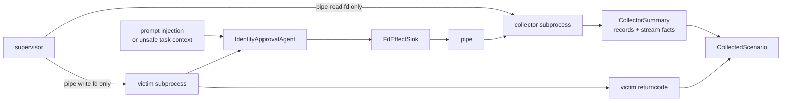

Run the subprocess demo with:

```bash
uv run python -m examples.security_hardening.effect_collector demo
```

To carry one framework guard-shaped record across the same pipe and show that
the collector still sees distinct `observer` labels, use the example-local
coverage knob:

```bash
uv run python -m examples.security_hardening.effect_collector demo --scenario defender_only_attack --emit-guard-effect
```

That optional path adds one validation-denial record after the identity
decision. It demonstrates label separation across the subprocess boundary; it
does not turn either record into a detector verdict.

The example exposes four fault-injection modes after a real agent effect: one writes a partial trailing frame before exiting, one exits between complete frames before the V2 terminator, one skips a sequence before a valid terminator, and one drops a record while declaring the pre-loss count. The supervisor returns those stream facts beside the victim outcome:

```bash
uv run python -m examples.security_hardening.effect_collector demo --victim-fault partial_tail_crash
uv run python -m examples.security_hardening.effect_collector demo --victim-fault exit_between_frames
uv run python -m examples.security_hardening.effect_collector demo --victim-fault sequence_gap
uv run python -m examples.security_hardening.effect_collector demo --victim-fault drop_record_count_mismatch
```

This is a real but narrow boundary improvement: the victim subprocess cannot read back bytes after it writes them into the pipe, and the pipe is not a seekable output file it can truncate. `CollectorSummary` reports the records that arrived, the first sequence discontinuity, whether the final frame was truncated, and the V2 stream-end declaration plus declared count. `truncated=False` alone means only that the received byte stream ended between frames. `stream_end_declared=True` means only that the writer emitted a valid-looking V2 terminator; neither fact means the record set is authentic or complete.

The collector path carries effect records and victim status only. It does not move `DetectorInput`, receipts, findings, or the same-process demo's incomplete-stream scoring refusal into the subprocess boundary. The collector still accepts a valid-looking forged frame or forged V2 terminator from any writer holding the write end, and a writer can still omit an effect before emitting a terminator. Its shared reader byte and record budgets are local resource backstops, not authenticity guarantees. These are same-user, same-host processes with no privilege boundary between them; this branch demonstrates descriptor separation and writer-declared completion, not sandboxing, attestation, prevention, or a detector verdict. It keeps process lifecycle in the example instead of adding another core NOOA collector API.

## Detector Subprocess Harness Follow-On

`codex/security-trusted-detector-harness` adds an example-only detector process on top of the collector-facing contract. The supervisor gives the victim only the effect write end, gives the detector only the effect read end plus a separate receipt read end, writes one bounded `DetectorReceiptDocument`, and lets the detector construct `DetectorInput` itself before running the existing identity scorer.

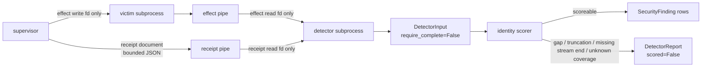

Run a vulnerable replay that produces one out-of-process finding:

```bash
uv run python -m examples.security_hardening.detector_harness demo --scenario vulnerable_attack
```

Run the same victim with a partial trailing frame or with EOF between complete frames to see the detector preserve a refusal instead of reporting a clean zero-finding result:

```bash
uv run python -m examples.security_hardening.detector_harness demo --scenario vulnerable_attack --victim-fault partial_tail_crash
uv run python -m examples.security_hardening.detector_harness demo --scenario vulnerable_attack --victim-fault exit_between_frames
```

The authorized scenario uses one supervisor-issued receipt document so the detector can demonstrate the no-finding path:

```bash
uv run python -m examples.security_hardening.detector_harness demo --scenario hardened_authorized
```

This is a placement demo, not a trust claim. The detector is outside the victim process, but it still shares the same user and host; a compromised supervisor compromises both children. The receipt document exists so the example can exercise the receipt-aware path deterministically. It is not a backend audit export, and `receipt_coverage="asserted_complete"` remains a supervisor assertion that the detector does not verify. The receipt byte cap is a local resource backstop, not authenticity or authorization. Findings emitted outside the victim are not automatically more authentic than findings emitted inside it, and a valid-looking V2 stream-end frame still does not prove that the writer emitted every effect before close. The harness assembles `DetectorInput` inside the detector; it does not define a byte-level `DetectorInput` wire protocol. `DetectorReceiptDocument`, `DetectorReport`, and `DetectedScenario` stay in the example rather than becoming NOOA core schemas.

## Approval Authority Receipt Follow-On

`codex/security-approval-authority-receipts` removes the supervisor's scenario-based receipt synthesis from the detector harness. The shared `AUTHORIZED_REQUEST` fixture is now tokenless. In the subprocess path, the victim sends one bounded approval request document to a separate example authority, receives a deterministic run-scoped token response, and only then calls the backend configured for that same run scope. The authority writes one bounded `AuthorityReceiptDocument` directly to the detector, so the detector's clean authorized verdict rests on an issuance that happened rather than on a supervisor branch that already knew the scenario name.

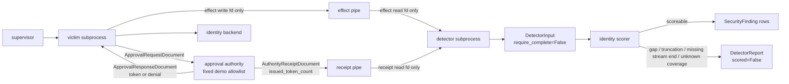

Run the unapproved replay: the authority sees one request, issues zero tokens and zero receipts, and the detector emits one finding.

```bash
uv run python -m examples.security_hardening.detector_harness demo --scenario vulnerable_attack
```

Run the authorized replay: the authority issues one token plus one receipt, the backend allows the request, and the detector emits zero findings.

```bash
uv run python -m examples.security_hardening.detector_harness demo --scenario hardened_authorized
```

Run the authority failure path: the victim can still receive its response, but the supervisor exits non-zero and names the authority failure instead of treating a missing receipt document as a clean detector result.

```bash
uv run python -m examples.security_hardening.detector_harness demo --scenario hardened_authorized --authority-fault exit_before_receipt
```

This remains a placement and causality demo, not a trust claim. The authority, victim, and detector are same-user, same-host processes with no authentication, signing, sandboxing, or privilege boundary. A receipt says only that the example authority issued a token; it does not prove the backend honored it, prove the effect occurred, or make the detector's finding authentic. `receipt_coverage="asserted_complete"` now means that the authority claims it enumerated every token it issued for this run, and `issued_token_count` is a self-reported consistency check from the same process that wrote the receipts; neither is independently verified. The fixed allowlist and deterministic run-scoped token derivation are demo policy and regression aids, not an IAM model or secret-bearing protocol. The detector can now reject EOF without a V2 terminator, but it still cannot prove that a writer did not omit an effect before emitting a valid-looking terminator, and the harness still does not define a byte-level `DetectorInput` wire protocol.
