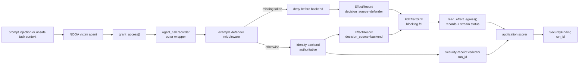
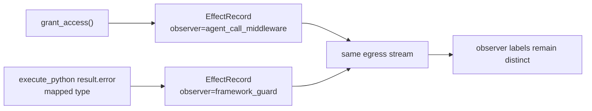

# Identity Approval Hardening Flow

This offline example shows how the security review slices compose around one identity-changing agent method. It starts after untrusted content has influenced a victim agent to call `grant_access`, then separates observed effect telemetry, a deterministic application-owned defender recipe, backend receipt collection, and application-local finding generation. Each scenario assigns one `run_id` to its out-of-band receipts and findings so a stale receipt from another run cannot suppress the current finding.



The same attack-shaped request is replayed across vulnerable, defender-only,
and backend-hardened configurations:

| Scenario | Backend policy | Middleware | Result source | Backend call | Receipt | Finding |
| --- | --- | --- | --- | --- | --- | --- |
| `vulnerable_attack` | Approval not enforced | Off | Backend allowed | Yes | No | Yes |
| `defender_only_attack` | Approval not enforced | Missing-token rule | Defender denied | No | No | No |
| `hardened_attack` | Approval enforced | Off | Backend denied | Yes | No | No |
| `hardened_authorized` | Approval enforced with valid token | Off | Backend allowed | Yes | Yes | No |

The `Finding` column reports only what this narrow scorer emits for these scripted inputs. A zero count is not a general safety claim. `defender_only_attack` has no backend call because the middleware short-circuits the method. The test suite keeps that middleware installed and calls the permissive backend directly to pin the non-claim that any path outside the guarded method can still grant.

Run it with:

```bash
uv run python examples/security_hardening/identity_approval.py
```

Expected table output (the script then prints per-scenario framed egress IDs):

```text
scenario             | decision | source   | backend | effects | receipts | findings
---------------------+----------+----------+---------+---------+----------+---------
vulnerable_attack    | allowed  | backend  | 1       | 1       | 0        | 1
defender_only_attack | denied   | defender | 0       | 1       | 0        | 0
hardened_attack      | denied   | backend  | 1       | 1       | 0        | 0
hardened_authorized  | allowed  | backend  | 1       | 1       | 1        | 0
```

This is a composition example, not a trust claim. The descriptor-backed sink, receipt collector, scorer, and defender middleware all run in one process for deterministic local execution. `run_scenario()` scores the collector-facing records returned by `read_effect_egress()` rather than the victim's in-memory event store, and it raises instead of scoring when that stream has a sequence discontinuity or truncated trailing frame. A same-process descriptor is still not trusted evidence. A production hardening path must hand `FdEffectSink` a separately controlled blocking descriptor, place the receipt source behind a separately trusted boundary, keep detector policy outside the victim process, and keep backend authorization authoritative. The direct-backend bypass probe stays in tests rather than the table because it intentionally leaves the observed agent method path and therefore does not create the `EffectRecord` input this narrow scorer requires.

The demo scopes only the out-of-band transport objects with `run_id`. `EffectRecord` keeps its existing runtime lineage fields; a real collector can stamp copied records through the open metadata dict when it needs the same assessment scope. The egress stream's sequence and truncation status only describe bytes received by the collector; they do not authenticate the writer, prove that omitted effects never happened, or turn transport health into a detector verdict.

The defender recipe is intentionally example-specific: it blocks only `grant_access()` requests without an approval token. It demonstrates existing `agent_call` middleware as a defense-in-depth seam; it does not become a generic NOOA policy API. The recorder is installed before the defender so the outer wrapper still records short-circuited denials; reversing that order would leave an inner recorder unable to observe the block. The demo keeps `grant_access()` async because the current `agent_call` recorder and defender observe async agent methods; a sync tool method would require a different observation seam.

On `codex/security-hardening-e2e-defender-provenance-egress`, the same event manager and egress stream can also carry guard-shaped observer records without confusing their label with the application grant effect:



The built-in guard record classifies a mapped `ctx.result.error` type; it does not prove that the exception originated in framework code. Generated code that raises the same public exception class can mint an indistinguishable record. The record is not fed into the identity scorer in this example and does not become a vulnerability verdict.

The fake LLM client only satisfies `Agent` construction; no generation method runs in this deterministic flow.
