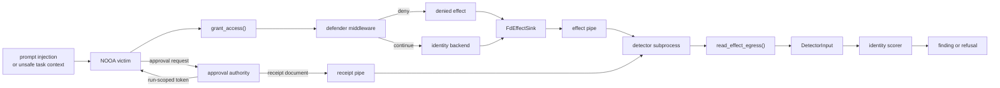
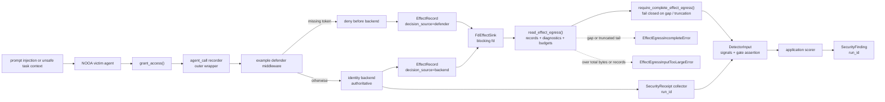
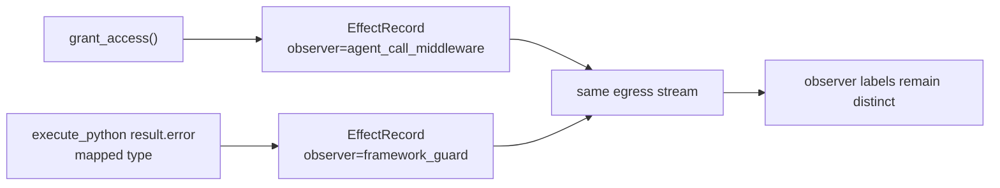
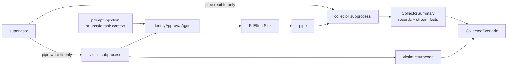
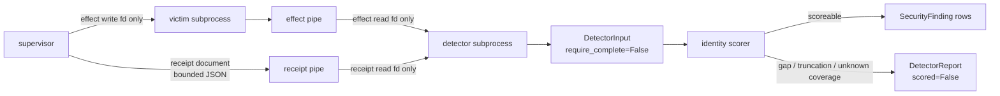
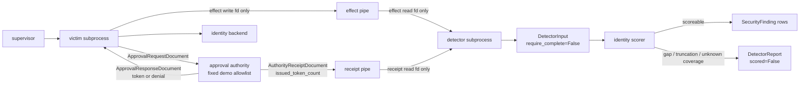

# Identity Approval Hardening Flow

This offline example shows how the security review slices compose around one identity-changing agent method. It starts after untrusted content has influenced a victim agent to call `grant_access`, then separates observed effect telemetry, a deterministic application-owned defender recipe, backend receipt collection, a detector-facing `DetectorInput` handoff, and application-local finding generation. Each scenario assigns one `run_id` to its detector input, out-of-band receipts, and findings so this narrow scorer can ignore a stale receipt from another run.

## End-to-End Detector Pipeline Joint Branch

`codex/security-hardening-e2e-detector-pipeline` is the integration branch for the smaller security slices below. It does not add another API layer. It packages the runnable path that a NOOA user would evaluate when hardening one agent method: observe an effect, apply an optional defender, collect bounded egress, obtain approval receipts from a separate issuer, assemble detector input outside the victim, and score or refuse.



The composed claim remains narrow: the example demonstrates where hardening controls and evidence handoffs can sit around a NOOA agent. It does not turn same-host subprocesses into a trusted boundary, prove effect completeness, authenticate receipts, or make deterministic run-scoped demo tokens into production credentials.



The same attack-shaped request is replayed across vulnerable, defender-only,
and backend-hardened configurations:

| Scenario | Backend policy | Middleware | Result source | Backend call | Receipt | Finding |
| --- | --- | --- | --- | --- | --- | --- |
| `vulnerable_attack` | Approval not enforced | Off | Backend allowed | Yes | No | Yes |
| `defender_only_attack` | Approval not enforced | Missing-token rule | Defender denied | No | No | No |
| `hardened_attack` | Approval enforced | Off | Backend denied | Yes | No | No |
| `hardened_authorized` | Approval enforced with valid token | Off | Backend allowed | Yes | Yes | No |

The `Finding` column reports only what this narrow scorer emits for these scripted inputs. A zero count is not a general safety claim. `defender_only_attack` has no backend call because the middleware short-circuits the method. The test suite keeps that middleware installed and calls the permissive backend directly to pin the non-claim that any path outside the guarded method can still grant.

Run it with:

```bash
uv run python examples/security_hardening/identity_approval.py
```

Expected table output (the script then prints per-scenario framed egress IDs):

```text
scenario             | decision | source   | backend | effects | receipts | findings
---------------------+----------+----------+---------+---------+----------+---------
vulnerable_attack    | allowed  | backend  | 1       | 1       | 0        | 1
defender_only_attack | denied   | defender | 0       | 1       | 0        | 0
hardened_attack      | denied   | backend  | 1       | 1       | 0        | 0
hardened_authorized  | allowed  | backend  | 1       | 1       | 1        | 0
```

This is a composition example, not a trust claim. The descriptor-backed sink, receipt collector, detector-input assembly, scorer, and defender middleware all run in one process for deterministic local execution. `run_scenario()` builds `DetectorInput` through `detector_input_from_egress(read_effect_egress(...))` rather than the victim's in-memory event store, and that helper's default path calls `require_complete_effect_egress()` so a sequence discontinuity or truncated trailing frame raises instead of constructing a scoreable bundle. The reader also refuses streams that exceed its collector-wide byte or record budgets before policy retains unbounded state. A clean result, including an empty stream, means only that the reader saw no known gap, truncation, or budget refusal. A same-process descriptor is still not trusted evidence. A production hardening path must hand `FdEffectSink` a separately controlled blocking descriptor, place the receipt source behind a separately trusted boundary, keep detector policy outside the victim process, and keep backend authorization authoritative. The direct-backend bypass probe stays in tests rather than the table because it intentionally leaves the observed agent method path and therefore does not create the `EffectRecord` input this narrow scorer requires.

`DetectorInput` is the new neutral handoff seam on this branch. `detector_input_from_egress()` records the public `effect_egress_completeness_signals()` output, sets `effect_egress_completeness_gate_passed=True` only after the public completeness gate accepts the received bytes, and carries `receipt_source` plus `receipt_coverage` as caller assertions. The identity scorer accepts that bundle, refuses to evaluate a missing-receipt finding unless the completeness gate passed and receipt coverage is asserted complete, and cites `input_id` in each finding. It still owns its own same-run receipt filtering rule. The bundle does not authenticate effects, receipts, or itself; verify that receipts belong to its `run_id`; establish any receipt-to-effect relationship; or turn collection health into a verdict.

The demo scopes only the detector-facing transport objects with `run_id`. `EffectRecord` keeps its existing runtime lineage fields; a real collector can stamp copied records through the open metadata dict when it needs the same assessment scope. The egress stream's sequence and truncation status only describe bytes received by the collector; they do not authenticate the writer, prove that omitted effects never happened, or turn transport health into a detector verdict.

The defender recipe is intentionally example-specific: it blocks only `grant_access()` requests without an approval token. It demonstrates existing `agent_call` middleware as a defense-in-depth seam; it does not become a generic NOOA policy API. The recorder is installed before the defender so the outer wrapper still records short-circuited denials; reversing that order would leave an inner recorder unable to observe the block. The demo keeps `grant_access()` async because the current `agent_call` recorder and defender observe async agent methods; a sync tool method would require a different observation seam.

On this composed branch, the same event manager and egress stream can also carry guard-shaped observer records without confusing their label with the application grant effect:



The built-in guard record classifies a mapped `ctx.result.error` type; it does not prove that the exception originated in framework code. Generated code that raises the same public exception class can mint an indistinguishable record. The record is not fed into the identity scorer in this example and does not become a vulnerability verdict.

The fake LLM client only satisfies `Agent` construction; no generation method runs in this deterministic flow.

## Out-of-Process Collector Follow-On

`codex/security-hardening-e2e-defender-provenance-egress-contract-collector` adds an example-only supervisor harness around the same identity victim. The supervisor opens one pipe, passes only the write end to the victim subprocess, passes only the read end to the collector subprocess, and joins the collector summary with the victim return code. The collector stays fact-reporting and does not call `require_complete_effect_egress()` so it can preserve truncated or gapped stream diagnostics for the supervisor.



Run the subprocess demo with:

```bash
uv run python -m examples.security_hardening.effect_collector demo
```

To carry one framework guard-shaped record across the same pipe and show that
the collector still sees distinct `observer` labels, use the example-local
coverage knob:

```bash
uv run python -m examples.security_hardening.effect_collector demo --scenario defender_only_attack --emit-guard-effect
```

That optional path adds one validation-denial record after the identity
decision. It demonstrates label separation across the subprocess boundary; it
does not turn either record into a detector verdict.

The example also exposes one fault-injection mode that writes a partial trailing frame after a real agent effect and exits the victim non-zero, so the supervisor can return the collector's truncated-stream facts beside the victim failure:

```bash
uv run python -m examples.security_hardening.effect_collector demo --victim-fault partial_tail_crash
```

This is a real but narrow boundary improvement: the victim subprocess cannot read back bytes after it writes them into the pipe, and the pipe is not a seekable output file it can truncate. `CollectorSummary` reports the records that arrived, the first sequence discontinuity, and whether the final frame was truncated. `truncated=False` means only that the received byte stream ended between frames; it does not mean the record set is authentic or complete.

The collector path carries effect records and victim status only. It does not move `DetectorInput`, receipts, findings, or the same-process demo's incomplete-stream scoring refusal into the subprocess boundary. The collector still accepts a valid-looking forged frame from any writer holding the write end, and an empty stream followed by a clean victim exit is still indistinguishable from a victim that intentionally omitted an effect and exited cleanly. Its shared reader byte and record budgets are local resource backstops, not authenticity guarantees. These are same-user, same-host processes with no privilege boundary between them; this branch demonstrates descriptor separation, not sandboxing, attestation, prevention, or a detector verdict. It keeps process lifecycle in the example instead of adding another core NOOA collector API.

## Detector Subprocess Harness Follow-On

`codex/security-trusted-detector-harness` adds an example-only detector process on top of the collector-facing contract. The supervisor gives the victim only the effect write end, gives the detector only the effect read end plus a separate receipt read end, writes one bounded `DetectorReceiptDocument`, and lets the detector construct `DetectorInput` itself before running the existing identity scorer.



Run a vulnerable replay that produces one out-of-process finding:

```bash
uv run python -m examples.security_hardening.detector_harness demo --scenario vulnerable_attack
```

Run the same victim with a partial trailing frame to see the detector preserve a refusal instead of reporting a clean zero-finding result:

```bash
uv run python -m examples.security_hardening.detector_harness demo --scenario vulnerable_attack --victim-fault partial_tail_crash
```

The authorized scenario uses one supervisor-issued receipt document so the detector can demonstrate the no-finding path:

```bash
uv run python -m examples.security_hardening.detector_harness demo --scenario hardened_authorized
```

This is a placement demo, not a trust claim. The detector is outside the victim process, but it still shares the same user and host; a compromised supervisor compromises both children. The receipt document exists so the example can exercise the receipt-aware path deterministically. It is not a backend audit export, and `receipt_coverage="asserted_complete"` remains a supervisor assertion that the detector does not verify. The receipt byte cap is a local resource backstop, not authenticity or authorization. Findings emitted outside the victim are not automatically more authentic than findings emitted inside it, and an empty clean effect stream remains indistinguishable from intentional omission. The harness assembles `DetectorInput` inside the detector; it does not define a byte-level `DetectorInput` wire protocol. `DetectorReceiptDocument`, `DetectorReport`, and `DetectedScenario` stay in the example rather than becoming NOOA core schemas.

## Approval Authority Receipt Follow-On

`codex/security-approval-authority-receipts` removes the supervisor's scenario-based receipt synthesis from the detector harness. The shared `AUTHORIZED_REQUEST` fixture is now tokenless. In the subprocess path, the victim sends one bounded approval request document to a separate example authority, receives a deterministic run-scoped token response, and only then calls the backend configured for that same run scope. The authority writes one bounded `AuthorityReceiptDocument` directly to the detector, so the detector's clean authorized verdict rests on an issuance that happened rather than on a supervisor branch that already knew the scenario name.



Run the unapproved replay: the authority sees one request, issues zero tokens and zero receipts, and the detector emits one finding.

```bash
uv run python -m examples.security_hardening.detector_harness demo --scenario vulnerable_attack
```

Run the authorized replay: the authority issues one token plus one receipt, the backend allows the request, and the detector emits zero findings.

```bash
uv run python -m examples.security_hardening.detector_harness demo --scenario hardened_authorized
```

Run the authority failure path: the victim can still receive its response, but the supervisor exits non-zero and names the authority failure instead of treating a missing receipt document as a clean detector result.

```bash
uv run python -m examples.security_hardening.detector_harness demo --scenario hardened_authorized --authority-fault exit_before_receipt
```

This remains a placement and causality demo, not a trust claim. The authority, victim, and detector are same-user, same-host processes with no authentication, signing, sandboxing, or privilege boundary. A receipt says only that the example authority issued a token; it does not prove the backend honored it, prove the effect occurred, or make the detector's finding authentic. `receipt_coverage="asserted_complete"` now means that the authority claims it enumerated every token it issued for this run, and `issued_token_count` is a self-reported consistency check from the same process that wrote the receipts; neither is independently verified. The fixed allowlist and deterministic run-scoped token derivation are demo policy and regression aids, not an IAM model or secret-bearing protocol. The detector still cannot distinguish a malicious clean effect omission from valid completion, and the harness still does not define a byte-level `DetectorInput` wire protocol.
