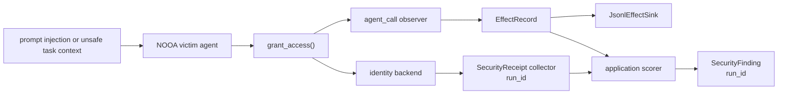
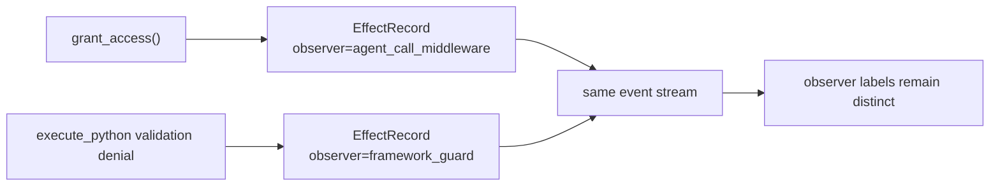

# Identity Approval Hardening Flow

This offline example shows how the security review slices compose around one identity-changing agent method. It starts after untrusted content has influenced a victim agent to call `grant_access`, then separates observed effect telemetry, backend receipt collection, and application-local finding generation. Each scenario assigns one `run_id` to its out-of-band receipts and findings so a stale receipt from another run cannot suppress the current finding.



The same attack-shaped request is run twice:

| Scenario | Backend policy | Result | Receipt | Finding |
| --- | --- | --- | --- | --- |
| `vulnerable_attack` | Approval not enforced | Allowed | No | Yes |
| `hardened_attack` | Approval enforced | Denied | No | No |
| `hardened_authorized` | Approval enforced with valid token | Allowed | Yes | No |

The `Finding` column reports only what this narrow scorer emits for these scripted inputs. A zero count is not a general safety claim.

Run it with:

```bash
uv run python examples/security_hardening/identity_approval.py
```

Expected table output (the script then prints per-scenario JSONL effect IDs):

```text
scenario            | decision | effects | receipts | findings
--------------------+----------+---------+----------+---------
vulnerable_attack   | allowed  | 1       | 0        | 1
hardened_attack     | denied   | 1       | 0        | 0
hardened_authorized | allowed  | 1       | 1        | 0
```

This is a composition example, not a trust claim. The JSONL sink, receipt collector, and scorer all run in one process for deterministic local execution. A production hardening path must place the sink and receipt source behind a separately trusted boundary and keep detector policy outside the victim process.

The demo scopes only the out-of-band transport objects with `run_id`. `EffectRecord` keeps its existing runtime lineage fields; a real collector can stamp copied records through the open metadata dict when it needs the same assessment scope.

On `codex/security-hardening-e2e-provenance`, the same event manager can also carry guard-shaped observer records without confusing their label with the application grant effect:



The built-in guard record classifies a mapped `ctx.result.error` type; it does not prove that the exception originated in framework code. Generated code that raises the same public exception class can mint an indistinguishable record. The record is not fed into the identity scorer in this example and does not become a vulnerability verdict.

The demo keeps `grant_access()` async because the current `agent_call` recorder observes async agent methods; a sync tool method would require a different observation seam.

The fake LLM client only satisfies `Agent` construction; no generation method runs in this deterministic flow.
