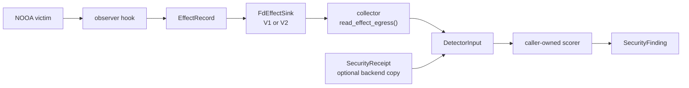
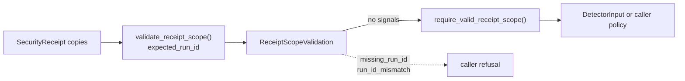
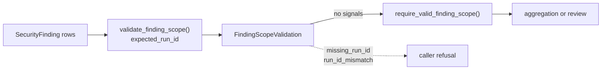

# NOOA Security Surface Guide

This guide consolidates the current `nooa.security` surface after the security hardening review slices. It is a map for application authors and reviewers, not a new security control or a product stability guarantee.

The package supplies transport shapes, observation hooks, effect egress, and detector handoff helpers. Applications still own policy, backend authorization, receipt provenance, detector logic, trust boundaries, and enforcement.



## Transport Types

| Type | Carries | Does not standardize |
| --- | --- | --- |
| `EffectRecord` | Sanitized observed-effect telemetry from an application or framework choke point. | Record authenticity, backend truth, or authorization policy. |
| `SecurityReceipt` | Sanitized backend or authority receipt copies with optional application-assigned run scope. | Receipt authentication, receipt-to-effect joins, or coverage verification. |
| `DetectorInput` | Collector-facing effects, public egress diagnostics, receipt copies, and caller assertions passed to detector policy. | Detector logic, verdicts, thresholds, or a trusted boundary. |
| `SecurityFinding` | Caller-owned finding records with opaque evidence references. | Severity, remediation, enforcement, or proof that evidence is genuine. |

All four types are portable shapes. Frozen field bindings do not make nested values tamper-resistant, and equal `run_id` values do not prove trusted provenance.

The checked transport vectors in `tests/security/fixtures/security_transport_conformance_v1.json` pin the current compact UTF-8 JSON bytes for representative `SecurityReceipt`, `SecurityFinding`, and `DetectorInput` instances, then validate those bytes back through the public models. They are regression references for the current `-v1` shapes, not authenticity proofs, total field-space coverage, or policy semantics.

## Receipt Scope Validation

`validate_receipt_scope()` is an opt-in collector helper for one narrow problem: keeping a supplied receipt bundle scoped to one caller-selected `expected_run_id`. It materializes the iterable once, preserves order, and reports only blank or mismatched `run_id` values. `require_valid_receipt_scope()` turns those visible diagnostics into a fail-closed boundary for callers that want one.



| Helper fact | Meaning |
| --- | --- |
| `missing_run_id` | At least one supplied receipt had an empty `run_id`. |
| `run_id_mismatch` | At least one supplied receipt had a non-empty `run_id` different from `expected_run_id`. |

A clean result means only that none of the supplied copies contradicted the requested scope. Directly constructing `ReceiptScopeValidation` asserts diagnostics; it does not perform the check. The helper does not authenticate receipt sources, verify coverage, check receipt-id uniqueness, correlate receipts to effects, inspect application attributes, or prove that an empty bundle is complete.

The `detector_harness.py` example shows one application-owned integration: when an authority receipt pipe is wired, it wraps the identity scorer with the supervisor-selected `run_id` and converts visible scope drift into an example-local refusal before policy runs. That placement does not make receipt scope automatic for `DetectorInput`, and the demo refusal string includes raw run and receipt identifiers that a real deployment may need to redact before crossing a process boundary.

## Finding Scope Validation

`validate_finding_scope()` is an opt-in consumer helper for one narrow problem: keeping a supplied finding bundle scoped to one caller-selected `expected_run_id` before aggregation, storage, or review. It materializes the iterable once, preserves order, and reports only blank or mismatched `run_id` values. `require_valid_finding_scope()` turns those visible diagnostics into a fail-closed boundary for callers that want one.



| Helper fact | Meaning |
| --- | --- |
| `missing_run_id` | At least one supplied finding had an empty `run_id`. |
| `run_id_mismatch` | At least one supplied finding had a non-empty `run_id` different from `expected_run_id`. |

A clean result means only that none of the supplied finding rows contradicted the requested scope. Directly constructing `FindingScopeValidation` asserts diagnostics; it does not perform the check. The helper does not authenticate finding producers, verify detector coverage, check finding-id uniqueness, dereference evidence refs, inspect application attributes, assign severity or verdict, or prove that an empty bundle is complete.

## Egress Contract

`FdEffectSink` writes LF-delimited UTF-8 JSON frames to a borrowed blocking descriptor. `read_effect_egress()` parses those frames and returns `EffectEgressReadResult`; `require_complete_effect_egress()` turns known reader-visible degradation into `EffectEgressIncompleteError`.

| Version | Writer behavior | Reader-visible completion rule |
| --- | --- | --- |
| V1 | Default record-only envelope, `schema_version="nooa-effect-egress-v1"`. | Clean means no observed sequence gap or trailing partial frame. |
| V2 | Opt-in envelope, `schema_version="nooa-effect-egress-v2"`, plus one `stream_end` frame from `FdEffectSink.close()`. | Clean additionally requires a writer-declared terminator and matching declared record count. |

V2 closes one narrow ambiguity: a collector that explicitly expects V2 can distinguish writer-declared completion from EOF between complete frames. It does not authenticate the writer or prove that every effect was emitted before close.

The checked producer reference vectors in `tests/security/fixtures/effect_egress_producer_conformance_v1.json` pin the bytes that this implementation's `FdEffectSink` emits today for representative V1 and V2 paths, then round-trip those bytes through `read_effect_egress()`. They are regression references for NOOA's producer output, not a requirement that independent writers use identical JSON formatting and not evidence that a producer is honest.

The reader exposes three local resource budgets:

| Budget | Meaning |
| --- | --- |
| `max_frame_bytes` | Maximum bytes for one LF-terminated frame. |
| `max_total_bytes` | Maximum payload bytes admitted to parsing across the whole stream. |
| `max_records` | Maximum complete record frames retained in memory. |

The public completeness signals are ordered and version-aware:

| Signal | Meaning |
| --- | --- |
| `first_sequence_error` | First observed `(expected, observed)` sequence discontinuity. |
| `truncated` | Final input ended inside an unterminated frame. |
| `missing_stream_end` | V2 was expected or observed, but no terminator frame arrived. |
| `record_count_mismatch` | A V2 terminator declared a count different from retained record frames. |

`missing_stream_end` is intentionally conditional. A V1 stream has no terminator concept, so a clean V1 stream must not become incomplete retroactively. An empty stream has no wire version; callers that need an empty V2 stream classified as missing a terminator must pass `expected_schema_version=EFFECT_EGRESS_SCHEMA_VERSION_V2`.

The deterministic same-process `identity_approval.py` example keeps the default V1 writer because it demonstrates the compatibility path and has no subprocess crash boundary. The subprocess collector and detector examples opt into V2 because they model a victim stopping between complete frames.

## Installation Seams

| Seam | Use |
| --- | --- |
| `install_effect_recorder()` | Observe `execute_python` outcomes with an application-owned `EffectObserver`. |
| `install_agent_call_effect_recorder()` | Observe async `agent_call` methods with an application-owned `AgentCallEffectObserver`. |
| `framework_guard_observer()` | Emit guard-shaped telemetry for selected mapped framework outcomes. |
| `install_effect_sink()` | Mirror `EffectRecord` objects from an event manager backend into an external sink. |
| `JsonlEffectSink` | Write raw record JSONL to a path chosen by the application. |
| `FdEffectSink` | Write framed collector-facing egress to a descriptor chosen by the application. |

The observer hooks record what an application chooses to observe; they do not make the in-process event manager trusted. `JsonlEffectSink` is a raw path sink, not the framed egress compatibility contract. `FdEffectSink` borrows its descriptor and does not close or authenticate it.

## Minimal Integration

This is the smallest complete path from one emitted effect through V2 egress into a caller-owned scorer. Production code still needs a separately controlled descriptor, a trusted receipt source when receipts matter, and policy-specific scorer logic.

```python
import os

from nooa.security import (
    EFFECT_EGRESS_SCHEMA_VERSION_V2,
    DetectorInput,
    EffectRecord,
    FdEffectSink,
    SecurityFinding,
    detector_input_from_egress,
    read_effect_egress,
)

read_fd, write_fd = os.pipe()
try:
    sink = FdEffectSink(write_fd, schema_version=EFFECT_EGRESS_SCHEMA_VERSION_V2)
    sink(EffectRecord(effect_type="data.export", target="external://bucket", decision="allowed"))
    sink.close()
finally:
    os.close(write_fd)

with os.fdopen(read_fd, "rb", closefd=True) as fh:
    egress = read_effect_egress(
        fh,
        expected_schema_version=EFFECT_EGRESS_SCHEMA_VERSION_V2,
    )

detector_input = detector_input_from_egress(
    egress,
    input_id="assessment-input-1",
    run_id="assessment-1",
)

def score_exports(input_: DetectorInput) -> tuple[SecurityFinding, ...]:
    return tuple(
        SecurityFinding(
            finding_id=f"finding-{record.id}",
            finding_type="data.export.allowed",
            producer="example-export-scorer",
            run_id=input_.run_id,
            target=record.target,
            evidence_refs=(input_.input_id, record.id),
        )
        for record in input_.effects
        if record.effect_type == "data.export" and record.decision == "allowed"
    )

findings = score_exports(detector_input)
assert detector_input.effect_egress_completeness_gate_passed is True
assert len(findings) == 1
```

The snippet above is the minimal API path inside one process. For a focused boundary path, run `python -m examples.security_hardening.minimal_detector demo`: that recipe moves the V2 writer and detector into separate child processes, gives each child only its effect-pipe endpoint, and keeps `DetectorInput` construction on the detector side. It remains a same-user placement example rather than an authentication, sandboxing, attestation, or completeness guarantee.

## Export Index

This index is checked by `tests/security/test_surface_guide.py`. Grouping is editorial only; it does not restrict access or declare long-term API stability.

<!-- SECURITY_EXPORT_INDEX_START -->
| Export | Audience | Purpose |
| --- | --- | --- |
| `EffectRecord` | Transport author | Observed-effect telemetry shape. |
| `SecurityReceipt` | Transport author | Backend or authority receipt shape. |
| `ReceiptScopeValidation` | Collector author | Materialized receipt bundle plus visible run-scope diagnostics. |
| `ReceiptScopeSignal` | Collector author | Public run-scope diagnostic type alias. |
| `ReceiptScopeError` | Collector author | Fail-closed run-scope refusal. |
| `DetectorInput` | Detector author | Detector-facing evidence bundle. |
| `SecurityFinding` | Detector author | Caller-owned finding shape. |
| `FindingScopeValidation` | Finding consumer | Materialized finding bundle plus visible run-scope diagnostics. |
| `FindingScopeSignal` | Finding consumer | Public run-scope diagnostic type alias. |
| `FindingScopeError` | Finding consumer | Fail-closed run-scope refusal. |
| `ReceiptCoverage` | Detector author | Caller assertion for receipt collection coverage. |
| `EffectObservation` | Observer author | Observer return union for zero, one, or many effects. |
| `EffectObserver` | Observer author | `execute_python` observer callable type. |
| `AgentCallEffectObserver` | Observer author | `agent_call` observer callable type. |
| `EffectSink` | Writer author | Sink callable type for effect copies. |
| `EffectRecordSinkBackend` | Writer author | Event-backend wrapper that mirrors effect records to a sink. |
| `JsonlEffectSink` | Writer author | Raw record JSONL path sink. |
| `FdEffectSink` | Writer author | Framed descriptor-backed egress writer. |
| `EffectEgressSinkClosedError` | Writer author | Ordered-close reuse error. |
| `EffectEgressSinkFailedError` | Writer author | Descriptor-failure reuse error. |
| `install_effect_recorder` | Observer author | Install `execute_python` effect observation. |
| `install_agent_call_effect_recorder` | Observer author | Install async `agent_call` effect observation. |
| `install_effect_sink` | Writer author | Mirror event-manager effect records to a sink. |
| `framework_guard_observer` | Observer author | Built-in guard-shaped telemetry observer. |
| `EffectEgressReadResult` | Reader author | Parsed records plus reader-visible stream diagnostics. |
| `EffectEgressCompletenessSignal` | Reader author | Public completeness-signal type alias. |
| `EffectEgressSchemaVersion` | Reader author | Implemented egress-version type alias. |
| `EffectEgressFrameTooLargeError` | Reader author | Per-frame budget refusal. |
| `EffectEgressInputTooLargeError` | Reader author | Whole-stream byte or record budget refusal. |
| `EffectEgressIncompleteError` | Reader author | Parsed stream failed the completeness gate. |
| `UnsupportedEffectEgressVersionError` | Reader author | Well-formed unsupported egress version. |
| `read_effect_egress` | Reader author | Parse framed effect egress. |
| `require_complete_effect_egress` | Reader author | Fail closed on public completeness signals. |
| `effect_egress_completeness_signals` | Reader author | Return canonical reader-visible diagnostics. |
| `validate_receipt_scope` | Collector author | Materialize one receipt iterable and diagnose visible run-scope drift. |
| `require_valid_receipt_scope` | Collector author | Fail closed on public receipt run-scope signals. |
| `receipt_scope_signals` | Collector author | Return canonical receipt run-scope diagnostics. |
| `validate_finding_scope` | Finding consumer | Materialize one finding iterable and diagnose visible run-scope drift. |
| `require_valid_finding_scope` | Finding consumer | Fail closed on public finding run-scope signals. |
| `finding_scope_signals` | Finding consumer | Return canonical finding run-scope diagnostics. |
| `detector_input_from_egress` | Detector author | Build one detector handoff bundle from parsed egress. |
| `DEFAULT_EFFECT_EGRESS_MAX_FRAME_BYTES` | Conformance implementer | Default per-frame byte budget. |
| `DEFAULT_EFFECT_EGRESS_MAX_RECORDS` | Conformance implementer | Default retained-record budget. |
| `DEFAULT_EFFECT_EGRESS_MAX_TOTAL_BYTES` | Conformance implementer | Default whole-stream byte budget. |
| `EFFECT_EGRESS_COMPLETENESS_SIGNALS` | Conformance implementer | Canonical completeness-signal order. |
| `EFFECT_EGRESS_FRAME_KEYS` | Conformance implementer | Record-frame key set. |
| `EFFECT_EGRESS_RECORD_EVENT_TYPE` | Conformance implementer | Record payload event discriminator. |
| `EFFECT_EGRESS_RECORD_KEYS` | Conformance implementer | Exact record payload key set. |
| `EFFECT_EGRESS_SCHEMA_VERSION` | Conformance implementer | Default V1 schema version token. |
| `EFFECT_EGRESS_SCHEMA_VERSION_V2` | Conformance implementer | V2 schema version token. |
| `EFFECT_EGRESS_SCHEMA_VERSION_PATTERN` | Conformance implementer | Future-version token pattern. |
| `EFFECT_EGRESS_SCHEMA_VERSION_PATTERN_MATCH_MODE` | Conformance implementer | Whole-token pattern match rule. |
| `EFFECT_EGRESS_STREAM_END_EVENT_TYPE` | Conformance implementer | V2 stream-end payload discriminator. |
| `EFFECT_EGRESS_STREAM_END_FRAME_KEYS` | Conformance implementer | V2 stream-end frame key set. |
| `EFFECT_EGRESS_STREAM_END_KEYS` | Conformance implementer | V2 stream-end payload key set. |
| `EFFECT_EGRESS_SUPPORTED_SCHEMA_VERSIONS` | Conformance implementer | Implemented reader and writer versions. |
| `MAX_EFFECT_EGRESS_JSON_INTEGER` | Conformance implementer | Largest portable JSON integer. |
| `MAX_EFFECT_EGRESS_SEQUENCE` | Conformance implementer | Largest accepted sequence number. |
| `RECEIPT_SCOPE_SIGNALS` | Conformance implementer | Canonical receipt run-scope diagnostic order. |
| `FINDING_SCOPE_SIGNALS` | Conformance implementer | Canonical finding run-scope diagnostic order. |
<!-- SECURITY_EXPORT_INDEX_END -->

## Consolidated Boundaries

- Effect telemetry is observed evidence, not backend truth or prevention.
- Same-process event stores, descriptors, subprocesses under one user, and unsandboxed supervisors are not trusted boundaries.
- V2 stream-end frames distinguish declared completion from stream cessation only. They do not authenticate records, prove omitted effects did not happen, or make count agreement sufficient evidence.
- Receipts remain caller-supplied copies. `validate_receipt_scope()` can reject blank or mismatched `run_id` values in the supplied bundle only; NOOA still does not authenticate receipt sources, verify receipt coverage, or correlate receipts to effects.
- Findings remain caller-supplied rows. `validate_finding_scope()` can reject blank or mismatched `run_id` values in the supplied bundle only; NOOA still does not authenticate finding producers, verify detector coverage, or dereference evidence refs.
- `DetectorInput` is a handoff object, not a detector. `SecurityFinding` is a transport shape, not a verdict, severity model, or enforcement action.
- Collector byte and record budgets are resource backstops, not authenticity or authorization guarantees.
- Framework guard-shaped records are labels for mapped outcomes, not proof of exception origin or vulnerability.

For runnable compositions and branch-by-branch rationale, see [`README.md`](README.md) in this directory.
